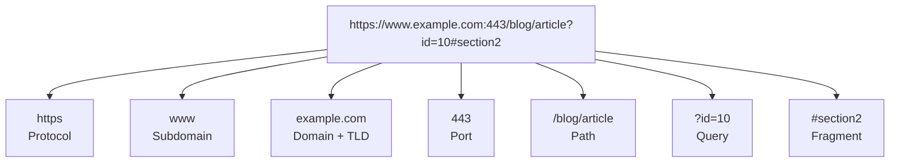

# Parts of a URL (Website Address)
*Source: Anup Panwar*

Example URL: `https://www.example.com:443/blog/article?id=10#section2`

> 📐 ডায়াগ্রাম — নিজের বোঝার জন্য যোগ করা

একটা URL আসলে একটা ঠিকানা নয়, **কয়েকটা আলাদা তথ্যের সমষ্টি** — প্রতিটা অংশ browser-কে ভিন্ন একটা প্রশ্নের উত্তর দেয়: কীভাবে যাব (protocol), কোথায় যাব (domain + port), কোন পাতা (path), কী ফিল্টার (query), পাতার কোন জায়গা (fragment)। বাঁ থেকে ডানে পড়লে অংশগুলো ক্রমশ **সুনির্দিষ্ট** হতে থাকে — সাধারণ থেকে নির্দিষ্ট।

- **Protocol (Scheme)**: ডেটা কীভাবে ট্রান্সফার হবে তা নির্ধারণ করে (HTTP/HTTPS, FTP, mailto)। HTTPS = SSL/TLS এনক্রিপশন সহ সিকিউর।
- **Subdomain**: ঐচ্ছিক অংশ, কনটেন্ট অর্গানাইজ করে (blog., api., shop.)।
- **Domain Name**: মূল ওয়েবসাইট নাম, ব্র্যান্ড আইডেন্টিটি, গ্লোবালি ইউনিক হতে হয়।
- **Top-Level Domain (TLD)**: ডোমেইন এক্সটেনশন (.com, .org, .net, .in, .uk)।
- **Port (Optional)**: সার্ভার পোর্ট নির্দিষ্ট করে (HTTP=80, HTTPS=443 ডিফল্ট)।
- **Path**: নির্দিষ্ট পেজ লোকেশন, ফোল্ডারের মতো স্ট্রাকচার্ড, SEO-র জন্য গুরুত্বপূর্ণ।
- **Query Parameters**: `?` দিয়ে শুরু, key-value pair, ফিল্টারিং/সার্চ/ট্র্যাকিং-এ ব্যবহৃত হয়, `&` দিয়ে একাধিক প্যারামিটার যুক্ত হয়।
- **Fragment (Anchor)**: পেজের নির্দিষ্ট সেকশনে পয়েন্ট করে, পেজ রিলোড করে না, single-page apps-এ ব্যবহৃত হয়।
