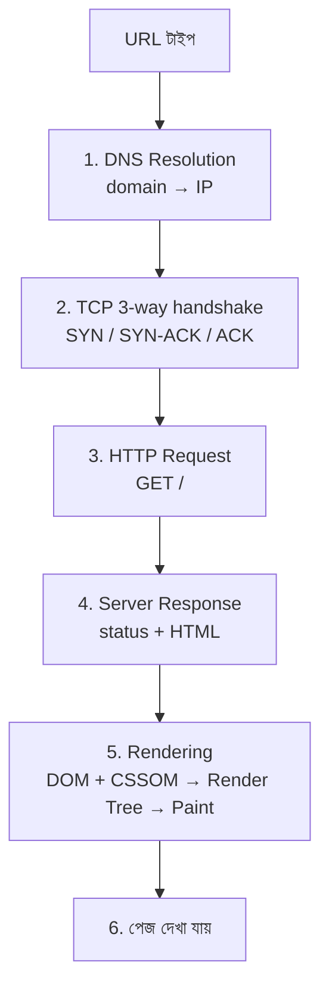

# What Happens When You Type In A URL in a Browser
*Created by: Rocky Bhatia*

> 📐 ডায়াগ্রাম — নিজের বোঝার জন্য যোগ করা

এই প্রশ্নটা ইন্টারভিউতে এত জনপ্রিয় কারণ এর উত্তরে **পুরো stack একসাথে ছুঁয়ে যায়** — DNS (naming), TCP (transport), HTTP (application), rendering (browser)। মূল কথা: প্রতিটা ধাপ আগেরটার ওপর দাঁড়িয়ে — IP না পেলে TCP হয় না, connection না হলে request যায় না। ধাপগুলো ক্রমিক, এলোমেলো নয়।

## ধাপসমূহ
1. **DNS Resolution**: `example.com` টাইপ করার পর ব্রাউজার IP খুঁজতে Cache → Browser → OS → Router → ISP ক্রমানুসারে চেক করে। ক্যাশ মিস হলে Root → TLD (.com) → 2nd Level → 3rd Level Domain Name Server পর্যন্ত যায়, শেষে IP (যেমন 8.9.0.1) পাওয়া যায়।
2. **TCP Connection**: TCP/IP 3-way handshake হয় — Client SYN পাঠায় → Server SYN-ACK পাঠায় → Client ACK পাঠায়।
3. **HTTP Request**: কানেকশন স্থাপনের পর `GET http://google.com` রিকোয়েস্ট পাঠানো হয়।
4. **Server Response**: সার্ভার স্ট্যাটাস কোড সহ রেসপন্স পাঠায় (1xx তথ্য, 2xx সফল, 3xx রিডাইরেক্ট, 4xx ক্লায়েন্ট এরর, 5xx সার্ভার এরর)।
5. **Rendering**: HTML+CSS+JS পার্স হয় — HTML Tokenizer → DOM Tree, CSS Tokenizer → CSSOM Tree → Render Tree → Layout → Painting। JavaScript লোড ও ইভ্যালুয়েট হয়।
6. **Final Load**: Browser Engine, Render Engine, Networking ও JS Engine মিলে ইউজার ইন্টারফেসে ওয়েব পেজ সফলভাবে লোড হয়।
