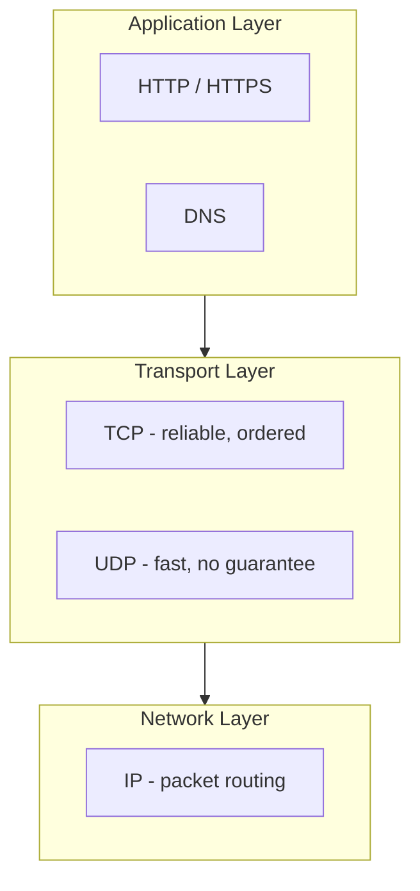

# Network Protocols Explained
*Source: ByteByteGo*

> 📐 ডায়াগ্রাম — নিজের বোঝার জন্য যোগ করা

প্রোটোকলগুলো **স্তরে সাজানো, আর উপরের স্তর নিচেরটার ওপর নির্ভর করে** — এটাই মূল ধারণা। HTTP নিজে ডেটা পৌঁছায় না; সে TCP-কে বলে "নির্ভরযোগ্যভাবে পৌঁছে দাও", TCP আবার IP-কে বলে "এই প্যাকেট ঐ ঠিকানায় রাউট করো"। প্রতিটা স্তর নিচেরটার জটিলতা লুকিয়ে রাখে, তাই HTTP লেখার সময় রাউটিং নিয়ে ভাবতে হয় না। TCP বনাম UDP-র পছন্দটাই transport স্তরের মূল সিদ্ধান্ত — নির্ভরযোগ্যতা নাকি গতি।

## Application Layer
- **HTTP**: TCP connection → HTTP Request → HTTP Response। Client-server request-response কমিউনিকেশন ডিফাইন করে।
- **HTTPS**: TCP connection → Certificate (Public Key) → Key-Exchange → Encrypted Data। TLS দিয়ে HTTP-কে সিকিউর করে (এনক্রিপশন + অথেন্টিকেশন)।
- **DNS**: Client ডোমেইন রিকোয়েস্ট করে (যেমন www.google.com) → DNS Resolver IP অ্যাড্রেস রিটার্ন করে। ডোমেইন নেইমকে IP অ্যাড্রেসে ম্যাপ করে।

## Transport Layer
- **TCP**: 3-way handshake (SYN → SYN+ACK → ACK)। রিলায়েবল, অর্ডারড, কনজেশন-কন্ট্রোলড ডেলিভারি নিশ্চিত করে।
- **UDP**: Datagram পাঠায় কোনো ডেলিভারি বা অর্ডারিং গ্যারান্টি ছাড়াই, দ্রুত গতিতে।

## Network Layer
- **IP**: Client → Router → Router → Router → Web Server। IP অ্যাড্রেস ব্যবহার করে নেটওয়ার্ক জুড়ে প্যাকেট রাউট করে।
