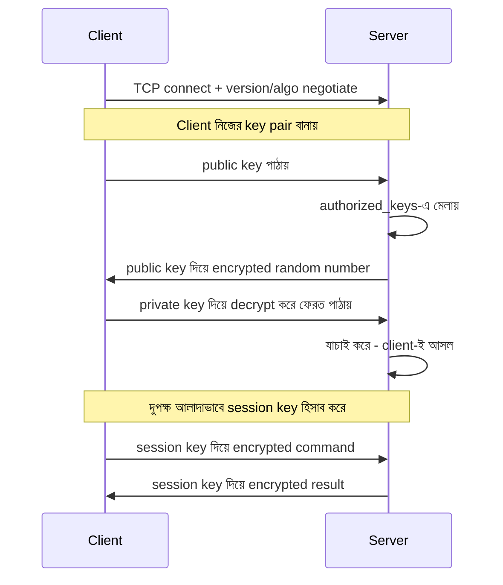

# How SSH Works?
*Source: ByteByteGo*

> 📐 ডায়াগ্রাম — নিজের বোঝার জন্য যোগ করা



SSH-এর নিরাপত্তা দুটো ধাপে ভাগ। প্রথমে **asymmetric** (public/private key) দিয়ে প্রমাণ হয় client আসলেই যার key server-এ আছে সে — server একটা random number তার public key দিয়ে encrypt করে পাঠায়, শুধু আসল private key দিয়েই সেটা খোলা যায়। প্রমাণ হয়ে গেলে দুপক্ষ একটা **symmetric session key** বানায় (যেটা দ্রুত), বাকি পুরো সেশন সেটা দিয়েই চলে। ধীর-কিন্তু-নিরাপদ দিয়ে শুরু, তারপর দ্রুত-কিন্তু-shared-এ সুইচ।

## SSH Handshake ও সেশন ফ্লো
1. Establish TCP connection
2. Supported version negotiation
3. Supported algorithms negotiation
4. Client generates public/private key pair
5. Client sends public key to server
6. Client initiates a login request
7. Server finds matching key (from `~/.ssh/authorized_keys`), encrypts message with public key
8. Server returns an encrypted random number
9. Client decrypts data using private key
10. Client sends decrypted data back
11. Server verifies client's decryption is correct
12. Session request and response (both sides calculate session key independently)
13. Client sends encrypted commands
14. Server decrypts command using session key
15. Server sends encrypted result
16. Client decrypts result using session key

## SSH Local Forwarding
```
local$ ssh -L p1:server:p2 remote
```
লোকাল মেশিনের পোর্ট (p1) সিকিউর টানেল ও ফায়ারওয়াল পার হয়ে রিমোট সার্ভারের পোর্টে (p2) ফরওয়ার্ড হয়।
