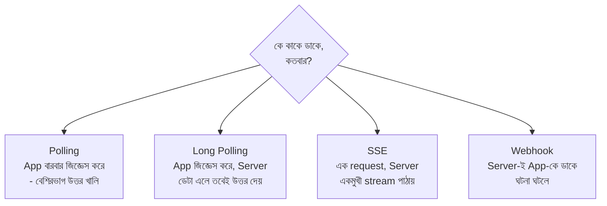

# Polling vs Long Polling vs Webhook vs SSE
*Source: ByteByteGo*

> 📐 ডায়াগ্রাম — নিজের বোঝার জন্য যোগ করা

চারটে পদ্ধতি আসলে একই প্রশ্নের চার উত্তর — **আপডেট কে টানবে, আর কতবার?** Polling-এ app বারবার টানে (বেশিরভাগ বার খালি হাতে ফেরে — অপচয়)। Long Polling সেই অপচয় কমায় — server ডেটা না আসা পর্যন্ত উত্তর ধরে রাখে। SSE একটাই connection খুলে server-কে ধারাবাহিক পাঠাতে দেয় (AI reply streaming-এর জন্য আদর্শ)। Webhook পুরো উল্টো — app টানেই না, **server-ই app-কে খবর দেয়** যখন ঘটনা ঘটে (payment success)। ডান দিকে যত যাবেন, তত কম অপচয় কিন্তু তত বেশি setup।

## Polling
অ্যাপ প্রতিবার আপডেট চেক করতে নতুন রিকোয়েস্ট পাঠায় (GET /updates → 200 OK, নির্দিষ্ট বিরতিতে পুনরাবৃত্তি হয়)।
**Use case**: প্রতি কয়েক সেকেন্ডে অর্ডার স্ট্যাটাস চেক করা

## Long Polling
অ্যাপ একটি রিকোয়েস্ট পাঠায়, সার্ভিস নতুন ডেটা না আসা বা টাইমআউট পর্যন্ত রেসপন্স ধরে রাখে, তারপর নতুন রিকোয়েস্ট পাঠানো হয়।
**Use case**: চ্যাট মেসেজ আসার সাথে সাথে দেখানো

## SSE (Server-Sent Events)
অ্যাপ একটি রিকোয়েস্ট পাঠায় এবং আপডেটের স্ট্রিম (one-way) পায় (`text/event-stream`)।
**Use case**: AI রিপ্লাই জেনারেট হওয়ার সাথে সাথে স্ট্রিম করা

## Webhook
সার্ভিস ইভেন্ট ঘটলে অ্যাপে রিকোয়েস্ট পাঠায় (setup-এ অ্যাপ সার্ভিসকে webhook URL দেয়, পরে POST /webhook)।
**Use case**: পেমেন্ট সাকসেস নোটিফিকেশন পাওয়া
