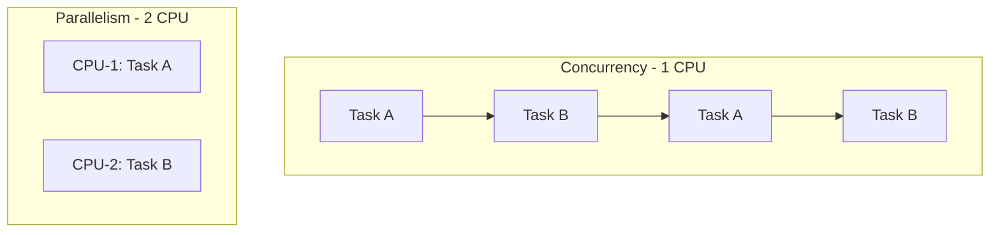

# Concurrency vs Parallelism
*© Level Up Coding*

> 📐 ডায়াগ্রাম — নিজের বোঝার জন্য যোগ করা

পার্থক্যটা একটা বাক্যে — **Concurrency মানে একসাথে সামলানো, Parallelism মানে একসাথে করা**। উপরের সারিতে একটাই CPU দ্রুত A আর B-এর মধ্যে সুইচ করছে; মনে হয় দুটো একসাথে চলছে, আসলে কোনো মুহূর্তে একটাই চলছে। নিচের সারিতে দুটো CPU সত্যিই একই মুহূর্তে A আর B চালাচ্ছে। Concurrency একটা কাঠামোগত ধারণা (কীভাবে কাজ ভাগ করি), Parallelism একটা বাস্তবায়ন (কতগুলো core আছে) — তাই একটা single-core মেশিনও concurrent হতে পারে, কিন্তু parallel নয়।

## Concurrency
একটি প্রসেসর একাধিক টাস্কের মধ্যে সুইচ করে — একই সময়ে একাধিক টাস্ক অগ্রসর হয় বলে মনে হয়, কিন্তু আসলে দ্রুত টাস্ক পরিবর্তন হয়।

## Parallelism
একাধিক প্রসেসর একই সময়ে সত্যিকারভাবে একাধিক টাস্ক এক্সিকিউট করে (simultaneously)।

**মূল পার্থক্য**: Concurrency = task switching (single processor), Parallelism = simultaneous execution (multiple processors)।
