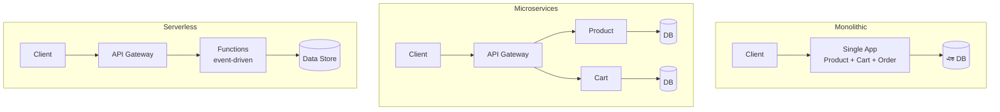

# Monolithic vs Microservices vs Serverless
*Source: ByteByteGo*

> 📐 ডায়াগ্রাম — নিজের বোঝার জন্য যোগ করা

তিনটে আসলে একই প্রশ্নের তিন উত্তর — **কোড আর deploy কতটা টুকরো করব?** Monolith: সব এক টুকরো (সহজ, কিন্তু একসাথে scale/deploy)। Microservices: প্রতিটা সার্ভিস আলাদা টুকরো, নিজের DB সহ (স্বাধীন scale, কিন্তু network ও DevOps জটিলতা)। Serverless: টুকরো এত ছোট যে সার্ভার ম্যানেজই করতে হয় না (auto-scale, কিন্তু cold start ও vendor lock-in)। বাঁ থেকে ডানে যত যাবেন, operational নিয়ন্ত্রণ কমে কিন্তু scaling সহজ হয়।

## Monolithic Architecture (মনোলিথিক)
Client → **Single Application** (Product/Cart/Order একসাথে) → এক deployable unit → একটাই Database

**সুবিধা**: সহজ develop ও test করা, একটাই deploy করতে হয়, debugging সহজ, ছোট দলে ভালো কাজ করে

**সমস্যা**: যেকোনো পরিবর্তনে পুরো app deploy করতে হয়, scale করা কঠিন, একটা সার্ভিসে সমস্যা হলে পুরো system বন্ধ

**কখন ব্যবহার করবে**: ছোট টিম, MVP/startup, দ্রুত ship করতে হলে

---

## Microservices Architecture (মাইক্রোসার্ভিসেস)
Client → API Gateway → **Independent Services** (Product/Cart/Order Service, প্রত্যেকের নিজস্ব DB - MongoDB, Redis, PostgreSQL)

**সুবিধা**: স্বাধীনভাবে scale/deploy করা যায়, একটা সার্ভিসে সমস্যা হলে বাকিগুলো চলে, বিভিন্ন ভাষায় লেখা যায়, বড় টিমে কাজ ভাগ করা সহজ

**সমস্যা**: network latency বাড়ে, distributed system জটিলতা, data consistency কঠিন, DevOps overhead বেশি

**কখন ব্যবহার করবে**: বড় টিম, high scale, ভিন্ন সার্ভিসের আলাদা scaling দরকার হলে

---

## Serverless Execution Model (সার্ভারলেস)
Client → API Gateway → **Serverless Functions** (event-driven, stateless) → Data Stores (SQL/NoSQL, Object Storage)

**সুবিধা**: সার্ভার ম্যানেজ করতে হয় না, automatically scale করে, ব্যবহার না হলে খরচ নেই, deployment সহজ

**সমস্যা**: cold start সমস্যা (প্রথম request slow হয়), দীর্ঘ execution কঠিন, vendor lock-in, debugging জটিল

**কখন ব্যবহার করবে**: event-driven কাজ, sporadic traffic, API endpoints

---

## তুলনামূলক সারসংক্ষেপ

| বিষয় | Monolith | Microservices | Serverless |
|-------|----------|---------------|------------|
| Complexity | কম | বেশি | মাঝামাঝি |
| Scaling | কঠিন | সহজ | স্বয়ংক্রিয় |
| Cost | কম | বেশি | Pay-as-use |
| Team Size | ছোট | বড় | যেকোনো |
