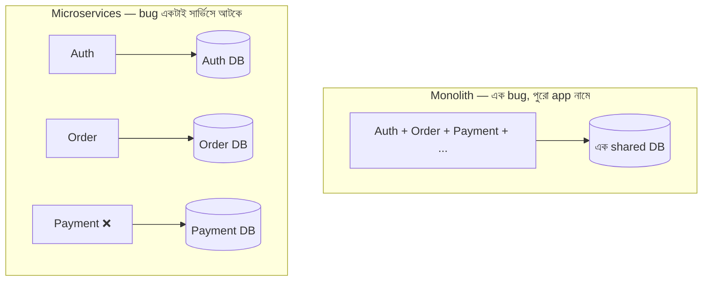

# Monolith vs Microservices — বিস্তারিত তুলনা

> 📐 ডায়াগ্রাম — নিজের বোঝার জন্য যোগ করা



আগের নোটটা (২.১.১) তিনটে মডেল পরিচয় করিয়েছে; এই ডকটা monolith বনাম microservices-এর **একটা নির্দিষ্ট পার্থক্যে** ফোকাস করে — blast radius, অর্থাৎ একটা ব্যর্থতা কতদূর ছড়ায়। Monolith-এ সব এক process, এক DB — Payment-এ bug হলে পুরো app নামতে পারে। Microservices-এ Payment ❌ হলেও Auth আর Order চলতে থাকে, কারণ তারা আলাদা process, আলাদা DB। এই isolation-ই microservices-এর মূল আকর্ষণ — দাম হলো network call আর distributed data-র জটিলতা।

## Monolith (মনোলিথ)
একটাই বড় application যেখানে সব কিছু একসাথে: UI, Business Logic, Database, Auth, API, Services — সবকিছু একই Database-এ সব কিছু access করে

```
Client → [UI + Auth + User + Order + Payment + Product + Notification] → Database
```

**বৈশিষ্ট্য**:
- সব কোড এক জায়গায়
- একটাই deploy করতে হয়
- একটা সার্ভিসে bug → পুরো app নামতে পারে
- যেকোনো কোড change করলে পুরো app আবার deploy

---

## Microservices (মাইক্রোসার্ভিসেস)

```
Client → API Gateway
├── Auth Service    → Auth DB
├── User Service    → User DB
├── Order Service   → Order DB
├── Payment Service → Payment DB
├── Product Service → Product DB
└── Notification Service → Notification DB
```

প্রতিটা সার্ভিস:
- **স্বাধীনভাবে** deploy ও scale হয়
- নিজস্ব Database রাখে (database per service)
- API-র মাধ্যমে একে অপরের সাথে কথা বলে
- বিভিন্ন programming language-এ লেখা যায়

---

## মূল পার্থক্য

| বিষয় | Monolith | Microservices |
|-------|----------|---------------|
| Deploy | একসাথে | আলাদা আলাদা |
| Database | একটা shared | প্রত্যেকের নিজস্ব |
| Scale | পুরোটা | নির্দিষ্ট সার্ভিস |
| Failure | পুরো system | শুধু সেই সার্ভিস |
| Team | ছোট, একসাথে | বড়, আলাদা টিম |
| Complexity | কম | অনেক বেশি |
| Latency | কম (in-process) | বেশি (network call) |

---

## কখন কোনটা বেছে নেবে?

- **Monolith দিয়ে শুরু করো** — যদি টিম ছোট হয়, requirement পরিষ্কার না থাকে
- **Microservices-এ যাও** — যখন scale দরকার, টিম বড়, বিভিন্ন সার্ভিস আলাদা আলাদা load পাচ্ছে
- **মনে রাখো**: অনেক বড় কোম্পানি (Amazon, Netflix) monolith দিয়ে শুরু করে পরে microservices-এ গেছে
