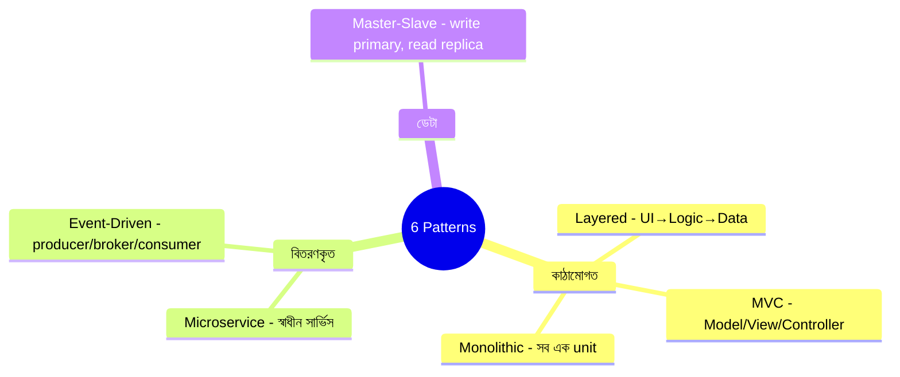

# Software Architectural Patterns
*Source: Anup Panwar*

সফটওয়্যার ডিজাইনে সবচেয়ে বহুল ব্যবহৃত architectural pattern গুলো:

> 📐 ডায়াগ্রাম — নিজের বোঝার জন্য যোগ করা



ছয়টা pattern মনে রাখার সহজ উপায় — এদের **তিন ভাগে** ভাবা। কাঠামোগত pattern (Layered, MVC, Monolithic) একটা app-এর *ভেতরটা* কীভাবে সাজানো তা বলে। বিতরণকৃত pattern (Microservice, Event-Driven) একাধিক সার্ভিস *কীভাবে যোগাযোগ* করে তা বলে। ডেটা pattern (Master-Slave) *ডেটা কীভাবে ছড়ানো* তা বলে। একটা বাস্তব system প্রায়ই কয়েকটা একসাথে ব্যবহার করে — যেমন microservices-এর ভেতরে প্রতিটা সার্ভিস Layered, আর তাদের DB Master-Slave।

---

## 1. Event-Driven Architecture
```
Event Producer → Event Broker (topics) → Event Consumers (A, B, C)
```
- Producer event publish করে, Consumer সেই event react করে
- সার্ভিসগুলো loosely coupled থাকে
- **উদাহরণ**: Kafka, RabbitMQ — order placed event → payment service, notification service আলাদাভাবে react করে
- **সুবিধা**: decoupled, scalable, async
- **সমস্যা**: event ordering কঠিন, debugging জটিল

---

## 2. Layered Architecture (স্তরভিত্তিক)
```
Presentation Layer (UI)
    ↓
Business/Application Layer (Logic)
    ↓
Data Access Layer (Repository)
    ↓
Persistence Layer (Database)
```
- প্রতিটা layer শুধু নিচের layer-এর সাথে কথা বলে
- **উদাহরণ**: ঐতিহ্যবাহী Java Spring, .NET applications
- **সুবিধা**: separation of concerns, testable
- **সমস্যা**: অনেক layer পার হতে হয়, performance কমতে পারে

---

## 3. Monolithic Pattern
```
User → [Posts + Comments + Groups + Photo Storage + Live Streaming] → Database
```
- সব কিছু একসাথে — পুরো system এক unit
- দেখো: 2.1.1 ও 2.1.2 নোট

---

## 4. Microservice Pattern
```
User → API Gateway → Catalog Service   → Catalog DB
                   → Shopping Cart     → Cart DB
                   → Discount Service  → Discount DB
                   → Ordering Service  → Order DB
```
- প্রতিটা সার্ভিস স্বাধীন ও নিজস্ব DB রাখে
- দেখো: 2.1.1 ও 2.1.2 নোট

---

## 5. MVC (Model-View-Controller)
```
User ↔ View (UI) ↔ Controller (Logic) ↔ Model (Data) ↔ Database
```
- **Model**: data এবং business logic
- **View**: user যা দেখে (UI)
- **Controller**: user input handle করে, model ও view সংযোগ করে
- **উদাহরণ**: Django, Rails, Laravel, Spring MVC
- **সুবিধা**: separation of concerns, test করা সহজ
- Web application ডিজাইনে সবচেয়ে জনপ্রিয়

---

## 6. Master-Slave Pattern (Primary-Replica)
```
Server → Master DB (write + read)
              ↓ (replication)
         ├── Slave 1 (read only)
         └── Slave 2 (read only)
```
- সব write Master-এ যায়
- Read Slave থেকে নেওয়া হয় → read load কমে
- **সুবিধা**: read performance উন্নত, backup স্বয়ংক্রিয়
- **সমস্যা**: replication lag, Master single point of failure

---

## সারসংক্ষেপ: কোনটা কখন?

| Pattern | ব্যবহার |
|---------|---------|
| Event-Driven | async workflows, decoupled services |
| Layered | ঐতিহ্যবাহী enterprise app |
| Monolithic | ছোট টিম, MVP |
| Microservice | বড় scale, বড় টিম |
| MVC | web applications |
| Master-Slave | read-heavy database |
