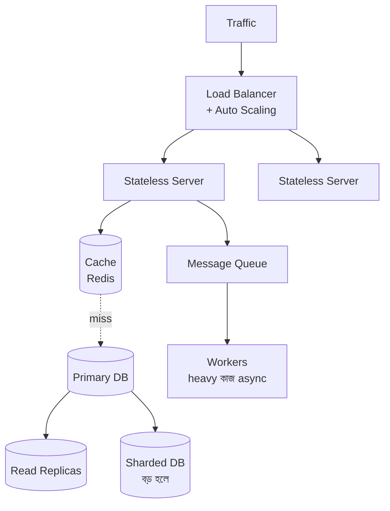

# How to Scale Your System
*Created by: Rocky Bhatia*

System scaling মানে বেশি load সামলানোর ক্ষমতা তৈরি করা। মূল কৌশলগুলো:

> 📐 ডায়াগ্রাম — নিজের বোঝার জন্য যোগ করা



আটটা কৌশল আলাদা টিপস নয় — এরা **একটাই scalable system-এর অংশ, আর একটা সাধারণ নিয়ম মানে: load ছড়িয়ে দাও, আর যেখানে পারো এড়িয়ে যাও**। Stateless server + load balancer load *ছড়ায়* (যেকোনো server যেকোনো request নিতে পারে); cache + replica database hit *এড়ায়*; queue ভারী কাজ পরে করার জন্য *সরিয়ে রাখে*; sharding একটা DB-র সীমা *ভাঙে*। নিচের checklist-টা মূলত এই ডায়াগ্রামটা বাঁ-থেকে-ডানে বানানোর ক্রম।

---

## 1. Stateless Services (স্টেটলেস সার্ভিস)
```
AZ1: [Server 1] [Server 2]
AZ2: [Server 3] [Server 4]
                ↓
         Shared State Store (Redis/DB)
```
- প্রতিটা request যেকোনো server handle করতে পারে
- Session data server-এ না রেখে shared store-এ রাখো
- **কেন দরকার**: নতুন server যোগ করলেই সহজে scale করা যায়

---

## 2. Load Balancing (লোড ব্যালান্সিং)
```
Client → Load Balancer → Server 1
                      → Server 2
                      → Server 3
```
- Incoming traffic সব server-এ সমানভাবে ভাগ করে দেয়
- **Algorithms**: Round Robin, Least Connections, IP Hash
- **Tools**: NGINX, HAProxy, AWS ELB
- **কেন দরকার**: একটা server-এ সব load না দিয়ে ভাগ করো

---

## 3. Horizontal Scaling (হরাইজন্টাল স্কেলিং)
- **Vertical**: একটা server শক্তিশালী করো (বেশি RAM/CPU) — সীমা আছে
- **Horizontal**: নতুন server যোগ করো — সীমাহীন
- Horizontal সবসময় বেশি flexible ও cost-effective

---

## 4. Async Processing (অ্যাসিঙ্ক প্রসেসিং)
```
Client → Server → Message Queue → Worker 1
                               → Worker 2
```
- সব কাজ সাথে সাথে করতে হবে না
- Email পাঠানো, video process করা — queue-এ রেখে পরে করো
- **Tools**: Kafka, RabbitMQ, SQS
- **কেন দরকার**: server responsive থাকে, heavy কাজ background-এ হয়

---

## 5. Database Sharding (ডেটাবেস শার্ডিং)
```
User ID 1-1000  → Shard (Partition) 1
User ID 1001-2000 → Shard (Partition) 2
```
- বড় database একটা server-এ রাখলে ধীর হয়
- Data ভাগ করে আলাদা server-এ রাখো
- **দেখো**: 3.2.2 Database Sharding Strategies

---

## 6. Caching (ক্যাশিং)
```
Read Request → Cache (miss?) → Database → Cache Update
Read Request → Cache (hit!) → Return immediately
```
- বারবার একই data database থেকে না নিয়ে cache-এ রাখো
- **Tools**: Redis, Memcached
- **দেখো**: 3.1.1 8 Types of Caching

---

## 7. Database Replication (রেপ্লিকেশন)
```
Primary DB (write + read)
      ↓ (sync)
Replica 1 (read only)
Replica 2 (read only)
```
- Reads গুলো Replica থেকে নেওয়া হয় → Primary-র load কমে
- Primary-তে শুধু Write যায়
- replication lag মাথায় রাখতে হবে

---

## 8. Auto Scaling (অটো স্কেলিং)
```
Traffic বাড়লে → Auto Scaling Group নতুন instance যোগ করে
Traffic কমলে → instance কমিয়ে দেয়
```
- **Tools**: AWS Auto Scaling, Kubernetes HPA
- Cost সাশ্রয়ী — প্রয়োজনমতো resource

---

## স্কেলিং চেকলিস্ট
1. ✅ Stateless services বানাও
2. ✅ Load balancer যোগ করো
3. ✅ Cache layer যোগ করো
4. ✅ Async queue ব্যবহার করো
5. ✅ Database replicate করো
6. ✅ Heavy data হলে shard করো
7. ✅ Auto scaling সেট করো
