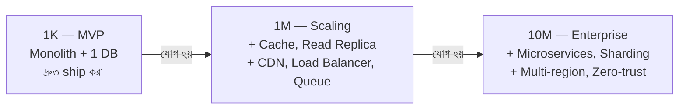

# System Design at 1K vs 1M vs 10M Users
*Source: Shalini Goyal*

ইউজার সংখ্যা বাড়ার সাথে সাথে system design কীভাবে বদলায়:

> 📐 ডায়াগ্রাম — নিজের বোঝার জন্য যোগ করা

মূল কথাটা তীরের ওপরের লেখায় — **প্রতিটা ধাপে আগেরটা ফেলে দেওয়া হয় না, ওপরে নতুন স্তর যোগ হয়**। 1K-তে লক্ষ্য দ্রুত শেখা, তাই সরল রাখা; over-engineer করা এখানে ভুল। 1M-এ লক্ষ্য বদলে হয় performance ধরে রাখা — cache, replica, CDN যোগ হয়। 10M-এ লক্ষ্য হয় সর্বোচ্চ availability — microservices, sharding, multi-region। তাই "কোন design সঠিক" প্রশ্নটা অর্থহীন; প্রশ্ন হলো "**কোন scale-এ**"।

---

## তুলনামূলক টেবিল

| বিষয় | 1K Users (MVP) | 1M Users (Scaling) | 10M Users (Enterprise) |
|-------|---------------|-------------------|------------------------|
| **মূল লক্ষ্য** | দ্রুত শিপিং ও শেখা | পারফরম্যান্স বজায় রাখা | সর্বোচ্চ পারফরম্যান্স |
| **Architecture** | সরল Monolith | Monolith/হালকা Microservices | পূর্ণ Microservices |
| **API** | সহজ REST | Versioned, rate-limited REST | API Gateway + REST/gRPC |
| **Traffic** | পূর্বানুমানযোগ্য | মাঝারি, বাড়তে পারে | বিশাল, burst-সহ |
| **Backend** | Single instance | Horizontal scaling | Multi-region, শার্ড করা |
| **Database** | এক ছোট DB | Read replicas | Sharding/partitioning |
| **Caching** | নেই/সামান্য | Redis (app-level) | Multi-layer Cache + CDN |
| **Async** | সরাসরি call | Message queue শুরু | Event-driven পুরোপুরি |
| **Queue** | নেই/সামান্য | Kafka/RabbitMQ | বিতরণকৃত messaging |
| **Deploy** | Manual/সহজ CI/CD | Automated CI/CD | Kubernetes + GitOps |
| **Fault Tolerance** | গুরুত্ব কম | Retry/fallback | Circuit breaker, multi-AZ |
| **Observability** | সামান্য logging | Metrics + Alerting | SLO-based monitoring |
| **Security** | Basic auth | JWT + RBAC | Zero-trust, IAM |
| **Data Consistency** | Strong | Strong | Eventual যেখানে সম্ভব |
| **Tools** | Express, Flask, PostgreSQL | Redis, Nginx, Kafka, Docker | Kubernetes, Istio, Prometheus |

---

## মূল শিক্ষা

### 1K Users পর্যায়ে করণীয়:
- সহজ রাখো, over-engineer করো না
- একটা server, একটা DB যথেষ্ট
- মনোযোগ দাও product-market fit-এ

### 1M Users পর্যায়ে যোগ করো:
- **Caching**: Redis দিয়ে frequent reads cache করো
- **Read Replicas**: DB read load কমাও
- **CDN**: static files দ্রুত দাও
- **Load Balancer**: traffic ভাগ করো
- **Queue**: heavy processing background-এ নাও

### 10M Users পর্যায়ে:
- **Multi-region**: global users-এর জন্য কাছের region থেকে serve
- **Database Sharding**: horizontal DB scaling
- **Service Mesh**: Istio দিয়ে microservices manage
- **Zero-trust security**: প্রতিটা request verify
- **Full observability**: distributed tracing, SLO tracking
