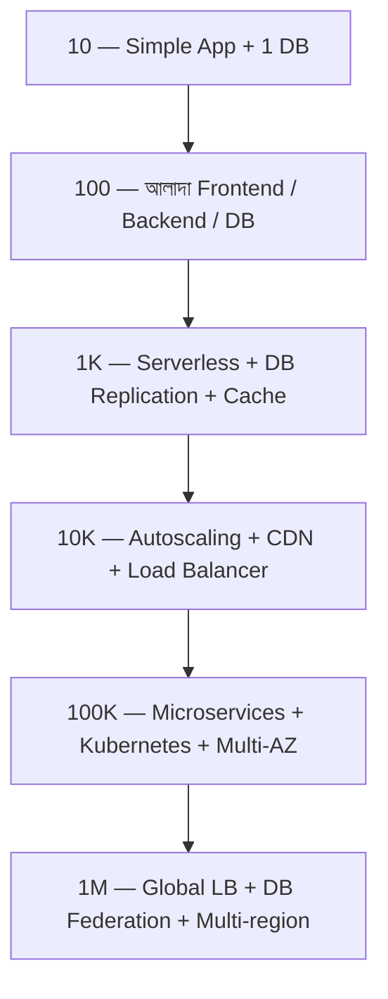

# How To Scale an App to 1 Million Users
*Source: Neo Kim + Unblocked*

একটা app কীভাবে ধাপে ধাপে ১০ ইউজার থেকে ১০ লাখ ইউজারে পৌঁছায়:

> 📐 ডায়াগ্রাম — নিজের বোঝার জন্য যোগ করা



এই সিঁড়িটার মূল শিক্ষা একটাই — **প্রতিটা ধাপে শুধু যা এখন দরকার তাই যোগ করো, আগে থেকে নয়**। ১০ ইউজারে multi-region ভাবা সময়ের অপচয় (premature optimization); আবার ১ লাখ ইউজারে single DB ধরে রাখা আত্মহত্যা। প্রতিটা লাফ আসে একটা নির্দিষ্ট bottleneck-এর জবাবে — DB ধীর হলে replica, static file ধীর হলে CDN, deploy ঝুঁকি হলে Kubernetes। ২.২.২-এর তুলনামূলক টেবিলটা এই একই যাত্রার আরেকটা কাটাছেঁড়া।

---

## ধাপ ১: Prelaunch (শুরু করার আগে)
- Static web framework ব্যবহার করো (HTML/CSS)
- কোনো backend দরকার নেই এখনো
- **লক্ষ্য**: idea validate করো

---

## ধাপ ২: Ten Users (১০ ইউজার)
- একটা simple full-stack app বানাও
- Shared hosting বা single VM যথেষ্ট
- Database হিসেবে SQLite বা PostgreSQL
- **লক্ষ্য**: কাজ করা একটা product তৈরি করো

---

## ধাপ ৩: Hundred Users (১০০ ইউজার)
- Frontend ও Backend আলাদা VM-এ রাখো
- Database আলাদা করো
- Basic monitoring যোগ করো
- **লক্ষ্য**: ভিন্ন components আলাদা করো

---

## ধাপ ৪: Thousand Users (১,০০০ ইউজার)
- **Serverless** functions ব্যবহার করো (Lambda)
- **Leader-Follower DB Replication** শুরু করো
- Cache layer যোগ করো (Redis)
- **লক্ষ্য**: server stability নিশ্চিত করো

---

## ধাপ ৫: Ten Thousand Users (১০,০০০ ইউজার)
- **Autoscaling** চালু করো
- **Stateless web servers** — load balancer দিয়ে replicate করো
- **CDN** দিয়ে static content দাও
- Popular reads cache করো
- **3-tier architecture**: Web → App → DB
- **লক্ষ্য**: horizontal scaling সক্ষম করো

---

## ধাপ ৬: Hundred Thousand Users (১,০০,০০০ ইউজার)
- **Microservices** architecture-এ যাও
- **Multiple Availability Zones** — AZ1, AZ2 — fault tolerance
- Backend ও DB-র মাঝে cache layer বাড়াও
- **Containers + Kubernetes** দিয়ে orchestrate করো
- **লক্ষ্য**: reliability ও independent scaling

---

## ধাপ ৭: Million Users (১০,০০,০০০ ইউজার)
- **Database Federation**: বিভিন্ন ধরনের data বিভিন্ন DB-তে
- **Database Partitioning**: সব data এক DB-তে রাখা সম্ভব না
- **Global Load Balancer**: বিশ্বজুড়ে traffic route করো
- **Multi-region deployment**: ইউজারের কাছের region থেকে serve
- **লক্ষ্য**: global scale ও ultra-high availability

---

## সারসংক্ষেপ চিত্র

```
10 Users    → Simple App + 1 DB
100 Users   → Separate Frontend/Backend/DB
1K Users    → Serverless + DB Replication + Cache
10K Users   → Autoscaling + CDN + Load Balancer
100K Users  → Microservices + Kubernetes + Multi-AZ
1M Users    → Global LB + DB Federation + Multi-region
```

> **মূল কথা**: প্রতিটা ধাপে শুধু যা দরকার তাই যোগ করো — premature optimization এড়িয়ে চলো।
