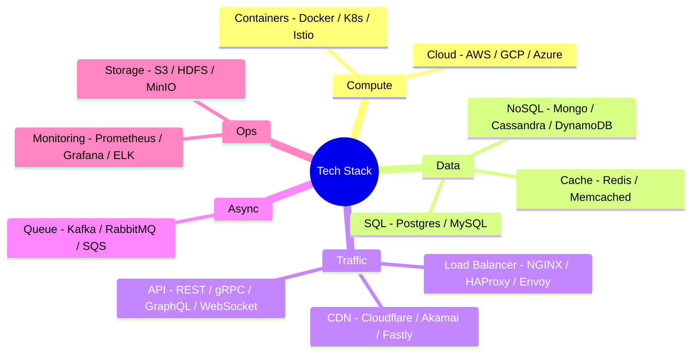

# System Design Tech Stack
*Created by: Rocky Bhatia*

System Design-এ প্রতিটা স্তরে কোন technology ব্যবহার হয়:

> 📐 ডায়াগ্রাম — নিজের বোঝার জন্য যোগ করা

এই তালিকা মুখস্থ করার জিনিস নয় — কাজে লাগে যখন **প্রতিটা টুলকে তার সমস্যার সাথে বাঁধতে পারো**। ইন্টারভিউতে "traffic ভাগ করব কীভাবে" প্রশ্নে NGINX/HAProxy, "static দ্রুত দেব কীভাবে" প্রশ্নে CDN, "সার্ভিস decouple করব কীভাবে" প্রশ্নে Kafka — এভাবে categoryটা মনে থাকলে নির্দিষ্ট নামটা মনে করা সহজ। ডায়াগ্রামের ডালগুলোই সেই সমস্যা→টুল ম্যাপিং।

---

## Cloud Platforms (ক্লাউড প্ল্যাটফর্ম)
- **AWS**: সবচেয়ে বেশি ব্যবহৃত, EC2, S3, RDS, Lambda
- **Google Cloud (GCP)**: BigQuery, Kubernetes (GKE), Vertex AI
- **Azure**: Microsoft ecosystem-এ বেশি পরিচিত
- **DigitalOcean**: সহজ ও সাশ্রয়ী, ছোট projects-এর জন্য

---

## Distributed System Algorithms
- **Gossip Protocol**: নোডগুলো একে অপরকে তথ্য দেয় (peer-to-peer)
- **Paxos / Raft**: distributed consensus — কে leader হবে ঠিক করে
- **Consistent Hashing**: নোড যোগ/বাদ দিলেও data কম re-distribute হয়

---

## CDN & Edge Computing
- **Cloudflare**: সবচেয়ে জনপ্রিয়, DDoS protection সহ
- **Akamai**: enterprise-level, বিশাল edge network
- **AWS CloudFront**: AWS-এর CDN
- **Fastly**: real-time cache purging-এ ভালো

---

## Monitoring & Logging
- **Prometheus**: metrics collection
- **Grafana**: metrics visualization/dashboard
- **ELK Stack**: Elasticsearch + Logstash + Kibana — log analysis
- **Loki**: Grafana-এর log aggregation tool

---

## Microservices & Orchestration
- **Docker**: container তৈরি
- **Kubernetes (K8s)**: container orchestration, auto-scaling
- **Istio**: service mesh — traffic management, observability
- **Linkerd**: হালকা service mesh

---

## API & Communication
- **REST**: সবচেয়ে সাধারণ, HTTP-based
- **gRPC**: Protocol Buffers দিয়ে দ্রুত, microservices-এ ব্যবহার
- **GraphQL**: client নিজে decide করে কী data চায়
- **WebSockets**: real-time two-way communication

---

## Message Queues & Streaming
- **Kafka**: high-throughput event streaming, দীর্ঘস্থায়ী storage
- **RabbitMQ**: async message broker, task queue
- **Amazon SQS**: managed queue service
- **Google Pub/Sub**: GCP-র managed pub/sub

---

## Databases

### NoSQL
- **MongoDB**: document-based, flexible schema
- **Cassandra**: wide-column, high availability, write-heavy
- **DynamoDB**: AWS managed, serverless, key-value
- **Couchbase**: multi-model

### SQL
- **PostgreSQL**: feature-rich, ACID compliant
- **MySQL**: সবচেয়ে পরিচিত
- **CockroachDB**: distributed SQL, horizontal scaling
- **MariaDB**: MySQL-এর open source fork

---

## Caching
- **Redis**: in-memory, data structures support, persistence option
- **Memcached**: সহজ, pure caching, Redis-এর চেয়ে হালকা

---

## Load Balancing
- **NGINX**: web server + reverse proxy + load balancer
- **HAProxy**: high-performance load balancer
- **Traefik**: container-native, dynamic configuration
- **Envoy**: L7 proxy, service mesh-এ ব্যবহার

---

## Storage & File Systems
- **Amazon S3**: object storage, সবচেয়ে জনপ্রিয়
- **HDFS**: Hadoop Distributed File System, big data
- **Ceph**: open source distributed storage
- **MinIO**: S3-compatible self-hosted storage
