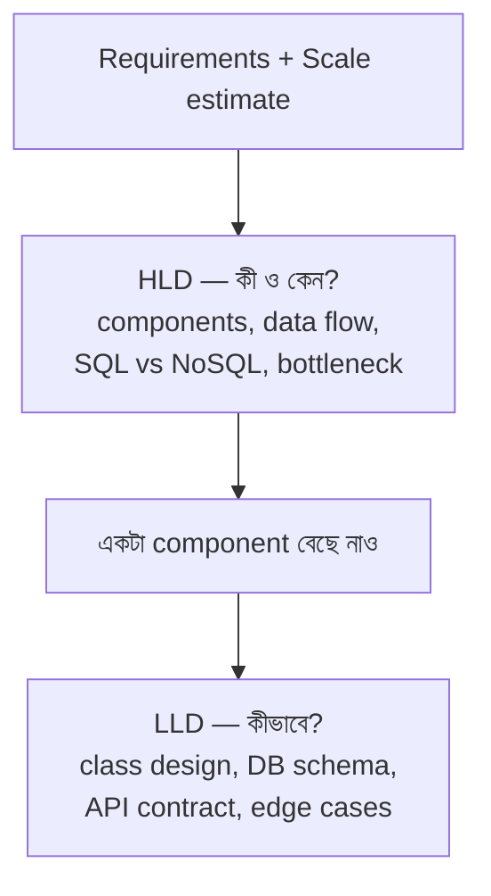

# HLD vs LLD — Interview-এ কী প্রত্যাশা করা হয়?

> 📐 ডায়াগ্রাম — নিজের বোঝার জন্য যোগ করা

মূল সম্পর্কটা হলো — **HLD আর LLD প্রতিযোগী নয়, একটা zoom-in**। HLD দূর থেকে পুরো system দেখে ("কোন components, কেন এই DB"); LLD একটা component-এর ভেতরে ঢোকে ("কোন class, কোন schema, কোন edge case")। ইন্টারভিউয়ের সঠিক ক্রমও তাই — আগে requirements ও scale, তারপর HLD দিয়ে big picture, তারপর একটা অংশে LLD deep-dive। সবচেয়ে সাধারণ ভুল এই ক্রম উল্টে সরাসরি code লেখা শুরু করা।

---

## HLD (High-Level Design) = Architecture চিন্তা

**"কী বানাবো এবং কেন?"**

HLD-তে যা থাকে:
- Overall system architecture diagram
- Major components ও services কী কী থাকবে
- Services-এর মধ্যে data কীভাবে flow করবে
- Scalability ও high availability কীভাবে নিশ্চিত হবে
- APIs, databases, caches (কোনটা ব্যবহার করবো)
- **Focus**: **কেন** এই design বেছে নিলাম?

**HLD Interview-এ যা করো**:
- Whiteboard-এ component diagram আঁকো
- ব্যাখ্যা করো প্রতিটা component কী করে
- Trade-offs নিয়ে কথা বলো (SQL vs NoSQL কেন?)
- Bottleneck কোথায় হতে পারে চিহ্নিত করো

---

## LLD (Low-Level Design) = Implementation চিন্তা

**"কীভাবে বানাবো?"**

LLD-তে যা থাকে:
- Class design ও relationships
- Database schema (tables, columns, indexes)
- API request/response structure
- Edge cases ও validations
- Design patterns (Singleton, Factory, Observer...)
- **Focus**: **কীভাবে** ঠিক কাজ করে?

**LLD Interview-এ যা করো**:
- Class diagram আঁকো
- Database schema লেখো
- API endpoints define করো
- Code snippet লেখো (optional কিন্তু impressive)

---

## পার্থক্য একনজরে

| বিষয় | HLD | LLD |
|-------|-----|-----|
| স্তর | System-level | Component-level |
| প্রশ্ন | কোন components? | কোন classes/methods? |
| Output | Architecture diagram | Class diagram, Schema |
| Focus | Scalability, availability | Code structure, patterns |
| Interview | Senior positions | Mid-level positions |

---

## Interview-এ কৌশল

> Strong candidates প্রথমে HLD দিয়ে শুরু করে big picture দেখায়, তারপর LLD দিয়ে implementation দেখায়।

**সঠিক ক্রম**:
1. Requirements clarify করো (functional + non-functional)
2. Scale estimate করো (users, QPS, storage)
3. HLD diagram আঁকো (5-10 min)
4. Deep-dive করো একটা component-এ (LLD)
5. Trade-offs ও improvements নিয়ে কথা বলো

**ভুল এড়িয়ে চলো**:
- সরাসরি code লেখা শুরু করা
- Requirements না জেনে design করা
- Interviewer-এর সাথে interactive না থাকা
