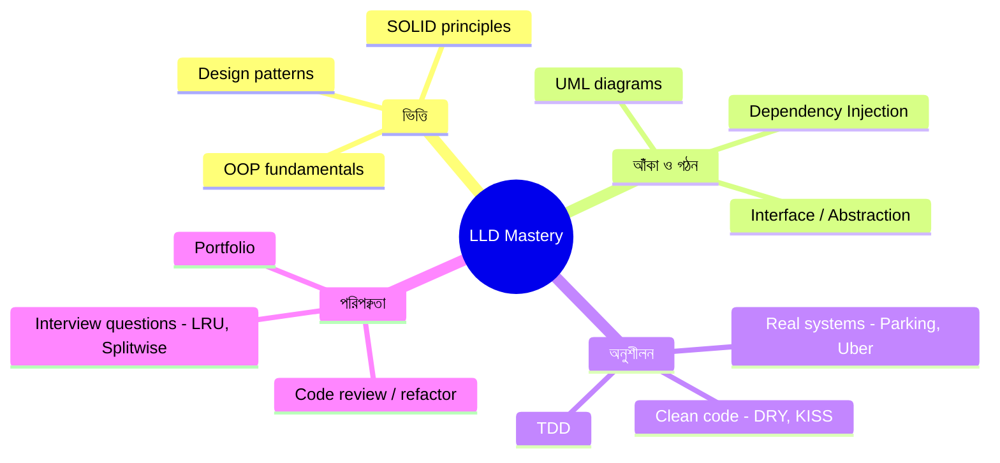

# LLD Master করার ধাপে ধাপে Roadmap
*Source: Shalini Goyal*

Low-Level Design (LLD) interview crack করতে হলে এই ১২টি ধাপ অনুসরণ করো:

> 📐 ডায়াগ্রাম — নিজের বোঝার জন্য যোগ করা

১২টা ধাপ একটা লম্বা তালিকা হিসেবে ভয় লাগায়; কিন্তু এরা আসলে **চারটে স্তরে ওঠে**। প্রথমে ভিত্তি (OOP, SOLID, patterns — "ভাষা")। তারপর সেই ভাষায় নকশা আঁকা ও গঠন (UML, DI, interface)। তারপর বাস্তব সমস্যায় হাত পাকানো (real systems, TDD, clean code)। শেষে পরিপক্বতা (review, interview, portfolio)। আগেরটা শক্ত না হলে পরেরটায় লাফ দিলে ভাঙবে — তাই ক্রমটাই মূল।

---

## ধাপ ১: OOP Fundamentals আয়ত্ত করো
- Classes ও Objects
- Encapsulation (data hiding)
- Abstraction (detail লুকিয়ে interface দেখানো)
- Inheritance ও Polymorphism
- Composition vs Inheritance (কখন কোনটা?)
- Access Modifiers, Static vs Instance
- Constructors ও Destructors

---

## ধাপ ২: SOLID Principles শেখো
- **S** — Single Responsibility: একটা class-এর একটাই কাজ
- **O** — Open/Closed: নতুন feature যোগ করা যাবে, পুরোনো কোড না বদলে
- **L** — Liskov Substitution: subclass parent-এর জায়গায় কাজ করবে
- **I** — Interface Segregation: ছোট ছোট interface ভালো
- **D** — Dependency Inversion: concrete-এর বদলে abstraction-এ depend করো

---

## ধাপ ৩: Design Patterns বোঝো (Real Use Cases সহ)

**Creational** (object তৈরি):
- Singleton, Factory, Builder, Prototype

**Structural** (object সংযোগ):
- Adapter, Decorator, Proxy, Facade, Composite

**Behavioral** (object আচরণ):
- Observer, Strategy, Command, State, Iterator

**এড়িয়ে চলো**: God Object, Spaghetti Code (anti-patterns)

---

## ধাপ ৪: UML Diagrams আঁকতে শেখো
- **Class Diagram**: classes ও তাদের সম্পর্ক
- **Sequence Diagram**: কে কাকে কখন call করে
- **Activity Diagram**: workflow
- **Relationships**: Association, Aggregation, Composition

---

## ধাপ ৫: Dependency Injection শেখো
- Constructor Injection, Setter Injection
- Interface-based programming
- Inversion of Control (IoC)

---

## ধাপ ৬: Real-World Systems Design করো
প্রতিটা system-এর entities চিহ্নিত করো, তাদের interaction ডিজাইন করো:

| System | মূল Focus |
|--------|-----------|
| Book My Show | Seat locking, booking flow |
| Parking Lot | State machine, slot allocation |
| Elevator System | State, queue management |
| Uber/Ride-Share | Matching algorithm, location |
| ATM Machine | Transaction, state |
| Splitwise | Expense tracking, debt simplification |
| Food Delivery | Order lifecycle |
| Hotel Booking | Room availability, conflict |

---

## ধাপ ৭: Interface ও Abstraction Design
- Designing contracts (interfaces)
- Loose Coupling নিশ্চিত করো
- Plug-and-play architecture

---

## ধাপ ৮: TDD (Test-Driven Development) অনুশীলন করো
- আগে test লেখো, তারপর implementation
- Mocking ও Stubbing
- Dependency Injection for testability

---

## ধাপ ৯: Clean Code Principles
- Meaningful naming
- ছোট functions ও classes
- **DRY** (Don't Repeat Yourself)
- **KISS** (Keep It Simple, Stupid)
- **YAGNI** (You Aren't Gonna Need It)

---

## ধাপ ১০: Existing Code Review ও Refactor
- Test coverage বাড়াও
- Tight coupling সরাও
- SOLID violations খুঁজে বের করো

---

## ধাপ ১১: LLD Interview Questions সমাধান করো
- LRU Cache
- Splitwise
- Logger
- File Storage Service
- Tic-Tac-Toe/Chess Game
- Notification System
- Elevator/Vending Machine

**প্রতিটায় করো**: class decomposition, design patterns, interfaces, state transitions

---

## ধাপ ১২: LLD Portfolio তৈরি করো
- UML diagrams
- Class responsibilities explain করো
- কোন patterns কেন ব্যবহার করলে
- Trade-offs আলোচনা করো
- Test cases ও documentation
