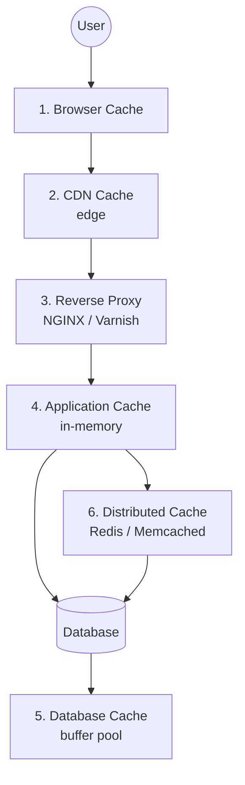

# 8 Types of Caching Used in System Design
*Created by: Rocky Bhatia*

Caching = ঘন ঘন ব্যবহৃত data দ্রুত access করার জন্য কাছে রাখা। System-এর বিভিন্ন স্তরে বিভিন্ন ধরনের cache থাকে।

---

## এক নজরে — cache গুলো কোথায় বসে

> 📐 ডায়াগ্রাম — নিজের বোঝার জন্য যোগ করা



এই ডায়াগ্রামের মূল কথাটা হলো — **৮টা cache আলাদা আলাদা বিকল্প নয়, এরা একটাই request path-এর পরপর স্তর**। একটা request ব্যবহারকারী থেকে database পর্যন্ত যেতে গিয়ে প্রতিটা স্তর পার হয়, আর যত আগের স্তরে থেমে যায় তত দ্রুত ও তত সস্তা।

তাই cache নিয়ে সিদ্ধান্তের আসল প্রশ্ন "কোন cache ব্যবহার করব" নয় — **"এই ডেটাটা কত আগে থামানো যায়"**। Static image ব্রাউজারেই থামা উচিত, ব্যবহারকারী-নির্দিষ্ট session distributed cache পর্যন্ত যাবে।

তালিকার **৭ ও ৮ নম্বর (Write-Through, Write-Back) এই ডায়াগ্রামে নেই** — কারণ ওগুলো cache-এর *জায়গা* নয়, cache-এ *লেখার কৌশল*। যেকোনো স্তরেই প্রয়োগ হতে পারে।

---

## 1. Browser Cache (ব্রাউজার ক্যাশ)
**কোথায়**: ইউজারের নিজের device-এ
**কী cache হয়**: HTML, CSS, JS, images

**মূল বিষয়**:
- `Cache-Control` headers দিয়ে কতক্ষণ রাখবে নিয়ন্ত্রণ করো
- `ETag/If-None-Match` দিয়ে file বদলেছে কিনা যাচাই
- Hard refresh (`Ctrl+Shift+R`) cache bypass করে

**সুবিধা**: Repeat visit দ্রুত, server load কমে
**সমস্যা**: Stale assets risk — পুরোনো JS/CSS দেখতে পারে

---

## 2. CDN Cache (সিডিএন ক্যাশ)
**কোথায়**: বিশ্বজুড়ে Edge locations-এ
**কী cache হয়**: Images, JS/CSS, Videos, Static content

**মূল বিষয়**:
- ইউজারের কাছের server থেকে serve করে — latency কমে
- TTL (Time-To-Live) দিয়ে কতক্ষণ রাখবে নিয়ন্ত্রণ করো
- Purge by URL দিয়ে নির্দিষ্ট file invalidate করো

**Tools**: Cloudflare, Akamai, AWS CloudFront, Fastly
**সুবিধা**: Global performance, কম bandwidth খরচ

---

## 3. Reverse Proxy Cache (রিভার্স প্রক্সি)
**কোথায়**: Client ও Backend Server-এর মাঝে
**কী cache হয়**: API responses, HTML pages

**মূল বিষয়**:
- NGINX/Varnish response cache করে রাখে
- একই request বারবার backend-এ না যায়
- SSL termination, rate limiting-ও করতে পারে

**Tools**: NGINX, Varnish
**সুবিধা**: Backend load কমে, দ্রুত API response

---

## 4. Application Cache (অ্যাপ্লিকেশন ক্যাশ)
**কোথায়**: Application server-এর memory-তে
**কী cache হয়**: Computed results, User sessions, Feature flags

**মূল বিষয়**:
- In-memory caching — সবচেয়ে দ্রুত
- Eviction policy: LRU (Least Recently Used), LFU (Least Frequently Used)
- Cache warming: app start-এ গুরুত্বপূর্ণ data আগে load করা

**সুবিধা**: Ultra-low latency reads
**সমস্যা**: Server restart-এ cache মুছে যায়

---

## 5. Database Cache (ডেটাবেস ক্যাশ)
**কোথায়**: Database engine-এর ভেতরে
**কী cache হয়**: Query results, Index data, Buffer pool

**মূল বিষয়**:
- DB নিজেই frequently run queries cache করে রাখে
- Buffer pool — disk থেকে না পড়ে memory থেকে পড়ে
- Hot rows cache — বারবার access হওয়া rows memory-তে

**সুবিধা**: DB I/O কমে, throughput বাড়ে
**সমস্যা**: Cache invalidation জটিল, read-heavy workload-এ সবচেয়ে ভালো

---

## 6. Distributed Cache (ডিস্ট্রিবিউটেড ক্যাশ)
**কোথায়**: আলাদা cache servers cluster-এ
**কী cache হয়**: বড় scale-এর shared data

**মূল বিষয়**:
- Redis/Memcached cluster-এ horizontal scaling সম্ভব
- TTL-based caching, Replication, Partitioning
- Multiple app server একই cache share করে

**Tools**: Redis Cluster, Memcached
**সুবিধা**: Microservices-এ shared state রাখতে পারে
**সমস্যা**: Cache consistency issues

---

## 7. Write-Through Cache (রাইট-থ্রু)
**কীভাবে কাজ করে**:
```
Write Request → Cache Update + DB Write (একসাথে)
Read Request  → Cache (always fresh)
```
**সুবিধা**: Cache ও DB সবসময় sync, stale data নেই
**সমস্যা**: Write slow হয় (দুই জায়গায় লিখতে হয়)
**কখন**: Critical data — bank balance, inventory

---

## 8. Write-Back Cache / Write-Behind (রাইট-ব্যাক)
**কীভাবে কাজ করে**:
```
Write Request → Cache Update (fast return)
                    ↓ (async, পরে)
               DB Write
```
**সুবিধা**: Write অনেক দ্রুত, high-write workload-এ ভালো
**সমস্যা**: Data loss risk যদি crash হয় DB-তে লেখার আগে
**কখন**: Non-critical data — analytics events, logging

---

## সারসংক্ষেপ

| Cache Type | স্তর | Best For |
|-----------|------|---------|
| Browser | Client | Static assets |
| CDN | Edge | Global static content |
| Reverse Proxy | Gateway | API/HTML responses |
| Application | App Server | Computed results |
| Database | DB Engine | Query optimization |
| Distributed | Separate Cluster | Shared session, microservices |
| Write-Through | Strategy | Strong consistency |
| Write-Back | Strategy | High-write performance |
