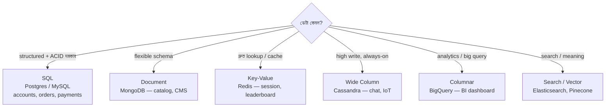

# Which Database to Use?
*Source: Hari Prasad Renganathan*

Database বেছে নেওয়া system design-এর সবচেয়ে গুরুত্বপূর্ণ সিদ্ধান্তগুলোর একটি।

> 📐 ডায়াগ্রাম — নিজের বোঝার জন্য যোগ করা

Database বাছাই আসলে **একটাই প্রশ্নের উত্তর: এই ডেটার access pattern কী?** — জনপ্রিয়তা নয়। Structured ডেটায় transaction লাগলে SQL; বিপুল write আর always-on লাগলে Cassandra (AP); দ্রুত key lookup-এ Redis। এর সাথে জোড়া লাগে **CAP theorem** (নিচে) — distributed হলে consistency আর availability-র একটা বেছে নিতেই হয়, কারণ network partition অবশ্যম্ভাবী। তাই "কোন DB সেরা" ভুল প্রশ্ন; "এই কাজের জন্য কোনটা" সঠিক।

---

## Database Types — Use Case অনুযায়ী

| ধরন | কখন ব্যবহার করবে | AWS | GCP | Open Source |
|-----|-----------------|-----|-----|-------------|
| **Relational (OLTP)** | Traditional apps, ERP, CRM, Financial | RDS, Aurora | Cloud SQL | PostgreSQL, MySQL |
| **Columnar (OLAP)** | Analytics, BI Dashboards, বড় queries | Redshift | BigQuery | Snowflake, ClickHouse |
| **Key-Value** | Session, Cache, দ্রুত lookup | DynamoDB | Bigtable | Redis, Riak |
| **In-Memory** | Ultra-fast caching, Leaderboards | ElastiCache | MemoryStore | Redis, Memcached |
| **Wide Column** | IoT, High-scale industrial apps | Keyspaces | Bigtable | Cassandra, HBase |
| **Time Series** | IoT metrics, Monitoring, DevOps | Timestream | BigQuery | InfluxDB, TimescaleDB |
| **Graph** | Social networks, Fraud detection | Neptune | - | Neo4j |
| **Document** | CMS, Flexible schema, Product catalog | DocumentDB | Firestore | MongoDB |
| **Text Search** | Full-text search, Autocomplete | OpenSearch | Cloud Search | Elasticsearch, Solr |
| **Blob Storage** | Files, Images, Videos | S3 | Cloud Storage | MinIO |
| **Vector DB** | AI embeddings, Semantic search, RAG | OpenSearch (Vector) | Vertex AI Vector | Pinecone, Milvus, Chroma |
| **Ledger** | Tamper-proof audit trail | QLDB | - | Hyperledger |
| **Geospatial** | Maps, Logistics, Location queries | Keyspaces | BigQuery | PostGIS |

---

## মূল decision framework

### ১. SQL vs NoSQL কীভাবে বেছে নেবে?

**SQL (Relational) বেছে নাও যখন**:
- Data structured এবং schema fixed
- ACID transactions দরকার (bank, payment)
- Complex joins দরকার
- **উদাহরণ**: User accounts, Orders, Payments

**NoSQL বেছে নাও যখন**:
- Schema flexible, data varied
- Horizontal scaling দরকার
- High write throughput
- **উদাহরণ**: Social posts, IoT data, Product catalog

---

### ২. Interview-এ Common Choices

| Scenario | Database |
|----------|---------|
| User authentication | PostgreSQL/MySQL |
| Session storage | Redis |
| Real-time chat messages | Cassandra |
| Product search | Elasticsearch |
| Video/Image storage | S3 + CDN |
| Analytics dashboard | BigQuery/Redshift |
| Social graph (followers) | Neo4j |
| Real-time leaderboard | Redis Sorted Sets |
| ML embeddings/RAG | Pinecone/Milvus |
| Time-series metrics | InfluxDB |

---

## CAP Theorem মনে রাখো

যেকোনো distributed database এই তিনটির মধ্যে শুধু **দুটো** guarantee করতে পারে:
- **C**onsistency — সব node-এ একই data
- **A**vailability — সবসময় response দেবে
- **P**artition Tolerance — network split হলেও কাজ করবে

> Network partition real world-এ অবশ্যম্ভাবী, তাই CP বা AP বেছে নিতে হয়।

| Database | CAP Choice |
|----------|-----------|
| PostgreSQL | CP |
| Cassandra | AP |
| MongoDB | CP (configurable) |
| DynamoDB | AP |
