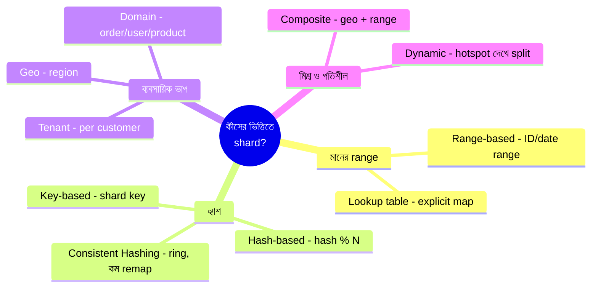

# Top Database Sharding Strategies
*Created by: Rocky Bhatia*

**Sharding** = বড় database-কে ছোট ছোট অংশে (shard/partition) ভাগ করে আলাদা আলাদা server-এ রাখা।

**কেন দরকার**: একটা server-এ সব data রাখলে — storage সীমিত, query ধীর, একটাই failure point।

> 📐 ডায়াগ্রাম — নিজের বোঝার জন্য যোগ করা



১০টা কৌশল আলাদা করে মুখস্থ করার দরকার নেই — এরা মূলত **shard বাছাই কীসের ভিত্তিতে হয় সেই একটা প্রশ্নের ভিন্ন উত্তর**। মানের range দেখে (সহজ, কিন্তু hot shard-এর ঝুঁকি), hash দেখে (সমান বিতরণ, কিন্তু node যোগ করলে remap — তাই consistent hashing), নাকি ব্যবসায়িক সীমা দেখে (tenant/geo/domain — isolation পায়)। সব কৌশলের একটাই আসল সিদ্ধান্ত: **shard key** — ভুল key নিলে যেকোনো কৌশলেই hot spot তৈরি হয়।

---

## 1. Range-Based Sharding (রেঞ্জ ভিত্তিক)
```
User ID 1-1000     → Shard 1
User ID 1001-2000  → Shard 2
User ID 2001-3000  → Shard 3
```
**কীভাবে**: নির্দিষ্ট range (ID, তারিখ) দেখে কোন shard-এ যাবে ঠিক করা হয়

**সুবিধা**: সহজ বোঝা ও implement করা, range query দ্রুত (e.g., date range)

**সমস্যা**: Hot shard — নতুন users সবসময় শেষ shard-এ যায়, load অসম হয়

---

## 2. Hash-Based Sharding (হ্যাশ ভিত্তিক)
```
hash(user_id) % 3 = 0 → Shard 1
hash(user_id) % 3 = 1 → Shard 2
hash(user_id) % 3 = 2 → Shard 3
```
**কীভাবে**: key-তে hash function চালিয়ে shard নির্ধারণ

**সুবিধা**: Load সমানভাবে বিতরণ হয়, hot spot কম

**সমস্যা**: নতুন shard যোগ করলে সব data re-distribute করতে হয় (consistent hashing দিয়ে সমাধান)

---

## 3. Lookup-Based Sharding (লুকআপ টেবিল)
```
Lookup Table:
user_id 1-500 → Shard A
user_id 501-900 → Shard B

Query → Lookup → Correct Shard
```
**কীভাবে**: একটা lookup table রেখে কোন record কোন shard-এ আছে জানা যায়

**সুবিধা**: Flexible, যেকোনো ভাবে map করা যায়

**সমস্যা**: Lookup table single point of failure, সেটাও scale করতে হবে

---

## 4. Tenant-Based Sharding (মাল্টিটেন্যান্ট)
```
Company A → Shard 1
Company B → Shard 2
Company C → Shard 3
```
**কীভাবে**: SaaS products-এ প্রতিটা customer/tenant-এর data আলাদা shard-এ

**সুবিধা**: Data isolation, নির্দিষ্ট tenant-এর জন্য আলাদা performance

**সমস্যা**: বড় tenant ছোট shard-এ আটাতে সমস্যা

---

## 5. Geo-Based Sharding (ভৌগোলিক)
```
Asia users    → Asia Shard (Singapore)
Europe users  → Europe Shard (Frankfurt)
US users      → US Shard (Virginia)
```
**কীভাবে**: ইউজারের location/region দেখে কাছের shard-এ রাখা হয়

**সুবিধা**: Low latency, data sovereignty (GDPR compliance)

**সমস্যা**: Cross-region queries কঠিন

---

## 6. Composite Sharding (মিশ্র)
একাধিক strategy একসাথে — যেমন Geo + Range:
```
Asia + User ID 1-1000 → Shard A1
Asia + User ID 1001-2000 → Shard A2
```
**সুবিধা**: সবচেয়ে flexible

**সমস্যা**: সবচেয়ে জটিল implement করতে

---

## 7. Domain-Based Sharding (ডোমেইন ভিত্তিক)
```
Orders domain    → Order Shards
Products domain  → Product Shards
Users domain     → User Shards
```
**কীভাবে**: Microservices-এর মতো, প্রতিটা business domain-এর নিজস্ব shard

---

## 8. Dynamic Sharding (গতিশীল)
```
Traffic monitor → Hotspot detect → Split shard → Rebalance
```
**কীভাবে**: Traffic monitor করে automatically shard split করে

**সুবিধা**: Self-adapting, hotspot সমস্যা কমে

**সমস্যা**: সবচেয়ে জটিল, implementation কঠিন

---

## 9. Consistent Hashing (কনসিস্টেন্ট হ্যাশিং)
```
Ring: Node A — Node B — Node C — (Node A)
Key hash করলে ring-এ position → কাছের node-এ যায়
Node যোগ/বাদ দিলে শুধু কিছু key re-map হয়
```
**কেন গুরুত্বপূর্ণ**: Hash-based-এর সমস্যা সমাধান করে — নতুন node যোগ করলে সব data re-distribute হয় না

**ব্যবহার**: DynamoDB, Cassandra, CDN

---

## 10. Key-Based Sharding (কী ভিত্তিক)
```
Shard key = user_id, post_id, etc.
Key evaluate করে → নির্দিষ্ট shard
```
**কীভাবে**: একটা নির্দিষ্ট field (shard key) দেখে partition করা হয়

**সুবিধা**: Consistent access pattern

**সমস্যা**: ভুল shard key বেছে নিলে hot spot তৈরি হয়

---

## Interview-এ Sharding Tips

1. **Shard key সঠিকভাবে বেছে নাও** — high cardinality, even distribution
2. **Hot shard এড়াও** — hash বা composite strategy ব্যবহার করো
3. **Cross-shard queries কমাও** — related data একই shard-এ রাখো
4. **Re-sharding plan রাখো** — system grow করলে কী করবে?
5. **Consistent Hashing সম্পর্কে জানো** — প্রায়ই জিজ্ঞেস করা হয়
