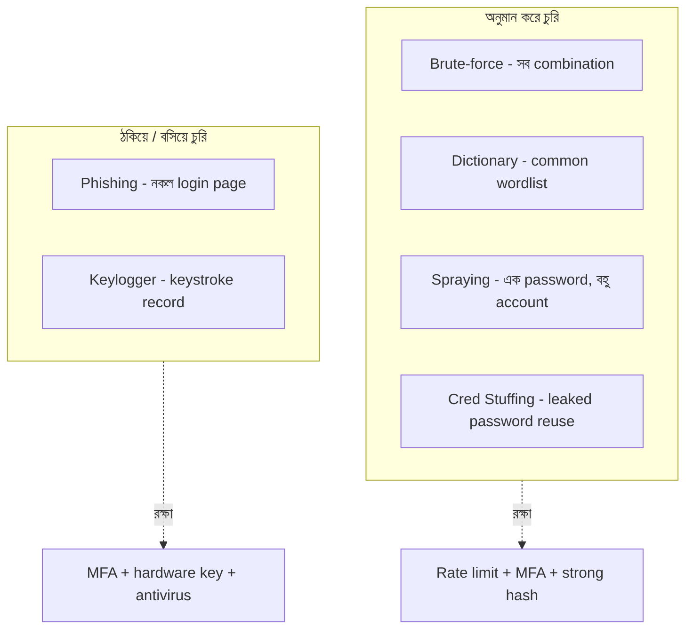

# How Hackers Steal Passwords
*Source: ByteByteGo*

পাসওয়ার্ড চুরির পদ্ধতি বোঝা জরুরি — কারণ এই আক্রমণগুলো থেকে রক্ষার জন্য সঠিক system design দরকার।

> 📐 ডায়াগ্রাম — নিজের বোঝার জন্য যোগ করা



ছয়টা আক্রমণ **দুই মৌলিক দলে** পড়ে, আর প্রতিটা দলের বিরুদ্ধে defense আলাদা। এক দল password *অনুমান* করে (brute-force, dictionary, spraying, stuffing) — এদের থামায় rate limiting, MFA, আর ধীর hashing (bcrypt/argon2), কারণ এরা সবই বহু চেষ্টার ওপর নির্ভর করে। আরেক দল ব্যবহারকারীকে *ঠকিয়ে বা device-এ বসে* password নেয় (phishing, keylogger) — এদের থামায় hardware key আর সতর্কতা, কারণ এখানে password যত শক্তই হোক ফাঁস হয়ে যায়। মূল শিক্ষা: hashing শুধু অনুমান-দলকে সামলায়, তাই MFA অপরিহার্য।

---

## 1. Brute-Force Attack (ব্রুট ফোর্স)

**কীভাবে কাজ করে**:
```
Attacker → password list তৈরি করে
         → bots/scripts দিয়ে automated login চেষ্টা
         → password match হলে → successful login
```
**বৈশিষ্ট্য**: সব possible combination চেষ্টা করে, ধীর কিন্তু নিশ্চিত

**রক্ষার উপায়**: Account lockout, Rate limiting, CAPTCHA, MFA

---

## 2. Dictionary Attack (ডিকশনারি অ্যাটাক)

**কীভাবে কাজ করে**:
```
Predefined wordlist (common passwords) → target-এ guess করে
→ match? → access পেলো | না মিললে → next word চেষ্টা
```
**বৈশিষ্ট্য**: Brute-force-এর চেয়ে দ্রুত কিন্তু সীমিত wordlist

**রক্ষার উপায়**: Complex password enforce করো, `123456`/`password` ব্লক করো

---

## 3. Credential Stuffing (ক্রেডেনশিয়াল স্টাফিং)

**কীভাবে কাজ করে**:
```
Data breach থেকে leaked credentials নেওয়া
→ Bots দিয়ে অন্য websites-এ try করা
→ যেখানে same password reuse হয় → access পাওয়া
```
**কেন বিপজ্জনক**: মানুষ অনেক জায়গায় same password ব্যবহার করে

**রক্ষার উপায়**: MFA, Unusual login detection, IP reputation check

---

## 4. Password Spraying (পাসওয়ার্ড স্প্রেয়িং)

**কীভাবে কাজ করে**:
```
একটাই common password (যেমন: Summer2024!)
→ অনেক অনেক accounts-এ try করা
→ Account lockout এড়াতে slowly করা
```
**বৈশিষ্ট্য**: Brute force উল্টো — একটা password, অনেক accounts

**রক্ষার উপায়**: Anomaly detection, unusual login pattern alert

---

## 5. Phishing Attack (ফিশিং)

**কীভাবে কাজ করে**:
```
Attacker → fake login page তৈরি করে (real-এর মতো দেখতে)
         → victim-কে phishing link পাঠায় (email/SMS)
         → victim credentials দেয়
         → Attacker সেই credentials দিয়ে real site-এ login করে
```
**রক্ষার উপায**:
- HTTPS check করো
- Domain carefully দেখো (g00gle.com ≠ google.com)
- Hardware security key (FIDO2/WebAuthn)

---

## 6. Keylogger Malware (কীলগার)

**কীভাবে কাজ করে**:
```
Malware → victim-এর device-এ install হয়
         → silently চলে, সব keystroke record করে
         → captured keystrokes → attacker-এর server-এ পাঠায়
```
**রক্ষার উপায়**: Antivirus, Software update রাখা, Unknown attachment না খোলা

---

## System Design-এ Password Security

**Hashing** (সবচেয়ে গুরুত্বপূর্ণ):
- পাসওয়ার্ড কখনো plain text-এ store করবে না
- **bcrypt/argon2** use করো — slow hashing (brute force কঠিন করে)
- **Salt** যোগ করো — same password আলাদা hash পাবে

**Rate Limiting**:
- Login attempt সীমিত করো (5 বার fail → 30 min lockout)
- IP-based ও account-based উভয় রাখো

**MFA (Multi-Factor Authentication)**:
- Password + OTP/Authenticator App
- Hardware key (FIDO2) সবচেয়ে secure

**Monitoring**:
- Unusual login detect করো (নতুন দেশ, অদ্ভুত সময়)
- Breach database (HaveIBeenPwned API) চেক করো
