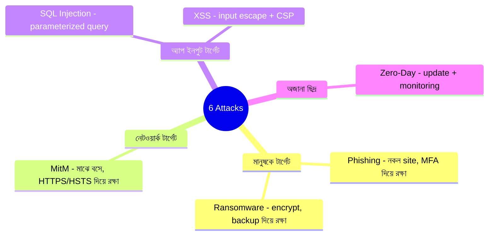

# Top Cyber Attacks Explained
*Source: ByteByteGo*

> 📐 ডায়াগ্রাম — নিজের বোঝার জন্য যোগ করা



আক্রমণগুলো মনে রাখার সহজ উপায় — **কোথায় আঘাত করে সেই অনুযায়ী ভাগ করা**, কারণ defense সেখানেই বসাতে হয়। মানুষকে টার্গেট করলে (phishing, ransomware) — training আর backup; network-এ বসলে (MitM) — HTTPS/HSTS; app-এর input দিয়ে ঢুকলে (SQL injection, XSS) — parameterized query আর input escaping। মূল নীতি নিচের সারাংশে: **defense-in-depth** — একটা স্তর ভাঙলেও পরেরটা যেন ধরে, কারণ কোনো একক measure নিশ্ছিদ্র নয়।

---

## 1. Phishing Attack (ফিশিং)

**কীভাবে কাজ করে**:
```
Attacker → Phishing link/email পাঠায়
Victim   → Link click করে credentials দেয় (fake site)
         → Account compromised
Attacker → credentials দিয়ে target site-এ login করে
```
**বাস্তব উদাহরণ**: নকল bank email, IT department-এর ভান করে password চাওয়া

**রক্ষার উপায়**:
- Email sender verify করো
- URL carefully দেখো
- MFA চালু রাখো
- Security awareness training

---

## 2. Ransomware (র্যানসমওয়্যার)

**কীভাবে কাজ করে**:
```
Malicious attachment/link
→ Ransomware execute হয়
→ সব files encrypt করে দেয়
→ Attacker বলে: "টাকা দাও, নইলে data মুছে দেবো"
```
**বাস্তব উদাহরণ**: WannaCry — ২০১৭ সালে বিশ্বজুড়ে হাসপাতাল, কোম্পানি আক্রান্ত

**রক্ষার উপায**:
- Regular backup রাখো (offline/offsite)
- Software update করো
- Email attachment সতর্কভাবে খোলো
- Network segmentation করো

---

## 3. Man-in-the-Middle (MitM) — মাঝখানে বসে আড়িপাতা

**কীভাবে কাজ করে**:
```
Victim ←→ [Attacker intercepts] ←→ Server
```
- Attacker ভিকটিম ও server-এর মাঝে বসে যায়
- traffic relay/পড়া/পরিবর্তন করতে পারে
- দুই পক্ষ মনে করে legitimate connection

**বাস্তব উদাহরণ**: Public WiFi-তে unencrypted traffic intercept

**রক্ষার উপায়**:
- HTTPS enforce করো (HTTP Strict Transport Security - HSTS)
- Certificate pinning
- Public WiFi-তে VPN ব্যবহার করো

---

## 4. SQL Injection (এসকিউএল ইঞ্জেকশন)

**কীভাবে কাজ করে**:
```
Normal query: SELECT * FROM users WHERE id = '1'
Attack input: 1' OR '1'='1

Result: SELECT * FROM users WHERE id = '1' OR '1'='1'
→ সব users-এর data বের হয়ে যায়!
```
**বাস্তব উদাহরণ**: Login form-এ `' OR 1=1 --` দিলে password ছাড়া login হয়ে যায়

**রক্ষার উপায়**:
- **Parameterized queries / Prepared Statements** ব্যবহার করো
- Input sanitize ও validate করো
- ORM (Hibernate, SQLAlchemy) ব্যবহার করো
- Least privilege — DB user-এর শুধু দরকারি permission দাও

---

## 5. Cross-Site Scripting — XSS (ক্রস-সাইট স্ক্রিপ্টিং)

**কীভাবে কাজ করে**:
```
Attacker → Malicious script inject করে (comment/form-এ)
User     → সেই page visit করে
Browser  → Script execute করে
         → Cookie/session চুরি হয়
```
**বাস্তব উদাহরণ**: Blog comment-এ `<script>document.cookie</script>` লিখলে অন্য visitors-এর cookie চুরি হয়

**রক্ষার উপায়**:
- Input escape করো output-এ
- Content Security Policy (CSP) header
- `HttpOnly` cookie flag — JS থেকে cookie পড়া বন্ধ

---

## 6. Zero-Day Exploits (জিরো-ডে)

**কীভাবে কাজ করে**:
```
Attacker → Software-এ অজানা security flaw খুঁজে পায়
         → Vulnerability publicly জানা হওয়ার আগেই exploit করে
         → Developer জানতে পারলেও তখন patch করার সময় পায়নি
```
**বিপজ্জনক কারণ**: কোনো defense নেই — patch আসার আগে vulnerable

**রক্ষার উপায়**:
- Software সবসময় update রাখো
- Vendor security bulletins follow করো
- Behavior-based security monitoring (anomaly detect করে)
- Network segmentation — একটা breach ছড়াতে না পারে

---

## Security সারসংক্ষেপ — System Design-এ

| আক্রমণ | মূল defense |
|--------|-------------|
| Phishing | MFA, Security training |
| Ransomware | Backup, Update, Segmentation |
| MitM | HTTPS, HSTS, VPN |
| SQL Injection | Parameterized queries |
| XSS | Input escaping, CSP |
| Zero-Day | Update, Monitoring |

> **মনে রাখো**: Security-in-depth (defence in layers) — একটা measure fail করলেও অন্যগুলো রক্ষা করবে।
