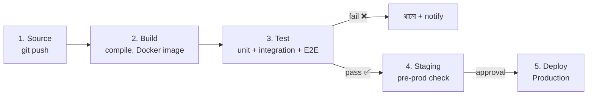

# CI/CD Pipeline Explained
*Source: Level Up Coding*

**CI/CD** = Continuous Integration / Continuous Deployment

**লক্ষ্য**: কোড লেখার পর ম্যানুয়াল কাজ ছাড়াই স্বয়ংক্রিয়ভাবে test ও production-এ পাঠানো।

> 📐 ডায়াগ্রাম — নিজের বোঝার জন্য যোগ করা



Pipeline-এর মূল ধারণা — **একটা conveyor belt যেখানে প্রতিটা ধাপ একটা gate**, আর কোনো gate ফেল করলে code সামনে এগোয় না। বাঁ দিকে source থেকে শুরু, ডান দিকে production-এ শেষ; মাঝে test সবচেয়ে গুরুত্বপূর্ণ gate — ব্যর্থ হলে সেখানেই থেমে notify হয় ("fail fast")। এর পুরো লক্ষ্য মানুষের হাত সরিয়ে দেওয়া, যাতে প্রতিটা commit একই নিরাপদ পথে যায়। CI মূলত প্রথম তিন ধাপ (build+test), CD শেষ দুই (staging+deploy)।

---

## CI/CD Pipeline-এর ৫টি ধাপ

### ধাপ ১: Source (সোর্স)
**কী হয়**: Developer কোড লেখে এবং repository-তে push করে

**Trigger**: Code push বা Pull Request merge হলে pipeline শুরু হয়

**Tools**: GitHub, GitLab, BitBucket

```
Developer → git push → Trigger Pipeline
```

---

### ধাপ ২: Build (বিল্ড)
**কী হয়**: কোড compile হয়, dependencies install হয়, artifact তৈরি হয়

**উদাহরণ**:
- Java → JAR/WAR file
- Node.js → npm install + bundle
- Docker image তৈরি

**Tools**: Jenkins, Gradle, CircleCI, Buildkite

```
Source Code → [Build] → Artifact (Docker Image / JAR)
```

---

### ধাপ ৩: Test (টেস্ট)
**কী হয়**: Automated tests চলে — pass/fail report আসে

**Test types**:
- **Unit Tests**: ছোট function/method test
- **Integration Tests**: সার্ভিসগুলো একসাথে কাজ করছে কিনা
- **E2E Tests**: পুরো user flow test

**Tools**: Selenium, Jest, Pytest, Cypress

```
Artifact → [Test Suite] → Pass ✅ (continue) | Fail ❌ (stop, notify)
```

---

### ধাপ ৪: Staging (স্টেজিং)
**কী হয়**: Production-এর মতো environment-এ deploy করে final check

**কেন গুরুত্বপূর্ণ**:
- Real traffic-এর মতো পরিবেশে test
- Production যাওয়ার আগে শেষ সুযোগ

**Tools**: AWS CodeDeploy, GitHub Actions, Argo CD, Azure DevOps

```
Artifact → [Staging Env] → Manual/Automated Approval → Next
```

---

### ধাপ ৫: Deploy (ডিপ্লয়)
**কী হয়**: সবকিছু ঠিক থাকলে production-এ deploy হয়

**Deployment Strategies**:
- **Rolling Deploy**: একটার পর একটা server update হয়
- **Blue-Green Deploy**: নতুন environment (green) তৈরি করে, সব traffic সেখানে সরিয়ে দাও
- **Canary Deploy**: প্রথমে ৫% traffic নতুন version-এ, ঠিক থাকলে ধীরে ধীরে বাড়াও

**Tools**: GitHub Actions, Argo CD, AWS CodeDeploy, Azure DevOps

---

## পুরো Pipeline একনজরে

```
Developer Push
      ↓
  [Source] GitHub/GitLab
      ↓
  [Build] Compile + Docker Image
      ↓
  [Test] Unit + Integration + E2E
      ↓ (fail → notify, stop)
  [Staging] Pre-prod environment
      ↓ (approval)
  [Deploy] Production ✅
```

---

## CI vs CD পার্থক্য

| CI (Continuous Integration) | CD (Continuous Delivery/Deployment) |
|----------------------------|-------------------------------------|
| কোড merge হওয়া মাত্র build ও test | Test পাস করলে staging/production-এ যাওয়া |
| Developer-এর কাজ fast feedback পাওয়া | Release দ্রুত ও নিরাপদ করা |
| Tool: Jenkins, GitHub Actions | Tool: Argo CD, AWS CodeDeploy |

---

## Best Practices

1. **প্রতিটা commit-এ pipeline চালাও** — সমস্যা দ্রুত ধরা পড়ে
2. **Fast feedback** — build + test ১০ মিনিটের মধ্যে শেষ করো
3. **Fail fast** — প্রথম ধাপেই problem ধরো
4. **Rollback plan রাখো** — production-এ সমস্যা হলে দ্রুত আগের version-এ ফিরতে পারো
5. **Infrastructure as Code** — Terraform/Ansible দিয়ে environment reproducible রাখো
6. **Secrets management** — API keys, passwords কখনো code-এ রাখবে না (Vault/SSM ব্যবহার করো)
