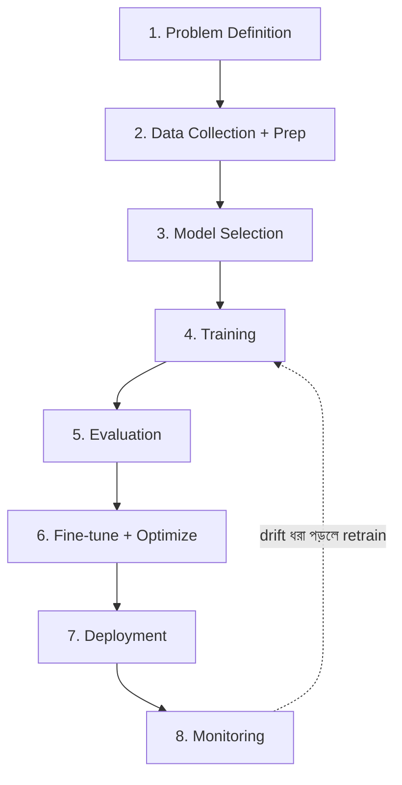

# How Production AI Systems Work
*Created by: Rocky Bhatia*

একটা AI system কীভাবে idea থেকে শুরু করে production-এ যায় — ৮টি ধাপে:

> 📐 ডায়াগ্রাম — নিজের বোঝার জন্য যোগ করা



Traditional software আর ML system-এর আসল পার্থক্যটা ঐ **নিচের ফিরতি তীরে** — এটা একমুখী পাইপলাইন নয়, একটা চক্র। কোড একবার ঠিক লিখলে ঠিকই থাকে; কিন্তু model-এর accuracy সময়ের সাথে নীরবে কমে (data drift), তাই monitoring থেকে আবার training-এ ফিরে retrain করতে হয়। তাই ML system-এ শুধু code নয়, **data আর model-ও** চলমানভাবে manage করতে হয় — এবং ব্যর্থতা এখানে crash নয়, নীরব accuracy পতন, যা ধরা অনেক কঠিন।

---

## ধাপ ১: Problem Definition (সমস্যা সংজ্ঞায়ন)

**কী করতে হবে**:
- ব্যবসায়িক সমস্যা কী? AI সত্যিই দরকার?
- Input কী হবে? Output কী হবে?
- Success metrics কী? (Accuracy, latency, cost)
- Constraints কী? (data privacy, compute budget)

**উদাহরণ**: "Email spam detection — 99% accuracy, <10ms latency"

---

## ধাপ ২: Data Collection & Preparation (ডেটা সংগ্রহ)

**কী করতে হবে**:
- ভেতরের/বাইরের উৎস থেকে data সংগ্রহ
- **Cleaning**: missing values, duplicates, noise সরানো
- **Labeling**: supervised learning-এ annotated data দরকার
- **Splitting**: Train / Validation / Test set
- **Augmentation**: কম data থাকলে synthetic data তৈরি

**Tools**: Pandas, Apache Spark, Label Studio, Snorkel

---

## ধাপ ৩: Model Selection & Development (মডেল বেছে নেওয়া)

**বিবেচনা**:
- Task অনুযায়ী model type: Classification, Regression, NLP, CV
- **Use pre-trained models** (LLM/Foundation Models) — zero থেকে train না করে
- Open-source (LLaMA, BERT) vs Proprietary (GPT-4, Claude)
- Experiment tracking: MLflow, Weights & Biases

---

## ধাপ ৪: Model Training (মডেল ট্রেইনিং)

**কী হয়**:
- Training data দিয়ে model parameters optimize করা
- Loss function minimize করা (gradient descent)
- Hyperparameter tuning (learning rate, batch size)
- Distributed training — বড় model-এর জন্য GPU cluster

**Tools**: TensorFlow, PyTorch, Hugging Face Transformers

---

## ধাপ ৫: Model Evaluation (মডেল মূল্যায়ন)

**কী দেখতে হবে**:
- **Metrics**: Accuracy, Precision, Recall, F1, AUC-ROC
- Validation set-এ performance
- **Overfitting** check — training-এ ভালো কিন্তু test-এ খারাপ?
- **Bias analysis** — নির্দিষ্ট group-এর জন্য unfair?
- A/B comparison — পুরোনো model-এর চেয়ে ভালো?

---

## ধাপ ৬: Fine-Tuning & Optimization (অপ্টিমাইজেশন)

**পদ্ধতি**:
- **Fine-tuning**: নির্দিষ্ট domain data দিয়ে pre-trained model adjust করা
- **Quantization**: model size কমানো (FP32 → INT8) — inference দ্রুত
- **Pruning**: অপ্রয়োজনীয় weights সরানো
- **Distillation**: বড় model → ছোট model শেখানো

---

## ধাপ ৭: Model Deployment (প্রোডাকশনে নিয়ে যাওয়া)

**Architecture**:
```
Client → API Gateway → Model Serving Service
                    → Model Artifact (S3/Registry)
                    → Feature Store (real-time features)
                    → Monitoring Service
```

**Serving patterns**:
- **Online/Real-time**: REST API, <100ms response
- **Batch**: রাতে বা নির্দিষ্ট সময়ে প্রচুর data process
- **Streaming**: Kafka দিয়ে continuous data

**Tools**: FastAPI, TorchServe, Triton, BentoML, Seldon

---

## ধাপ ৮: Monitoring & Governance (মনিটরিং)

**কী দেখতে হবে**:
- **Model Drift**: সময়ের সাথে accuracy কমছে? (data distribution বদলালে)
- **Data Drift**: input data-র pattern বদলেছে?
- **Latency & Throughput**: production-এ performance ঠিক আছে?
- **Fairness**: কোনো group-এর জন্য unfair হচ্ছে?
- **Cost**: inference cost বাড়ছে?

**Governance**:
- Model versioning ও rollback plan
- Audit trail — কে কোন সিদ্ধান্ত নিয়েছে
- Explainability — model কেন এই prediction করলো?

---

## ML System vs Traditional System পার্থক্য

| বিষয় | Traditional | ML System |
|-------|-------------|-----------|
| Behavior | Deterministic | Probabilistic |
| Testing | Unit/Integration tests | Model evaluation metrics |
| Debugging | Code bugs | Data/model issues |
| Deploy | Version bump | Model retraining |
| Failure | Code crash | Silent accuracy drop |

> **মূল কথা**: ML system-এ code ছাড়াও **data** ও **model** manage করতে হয় — এটাই সবচেয়ে বড় পার্থক্য।
