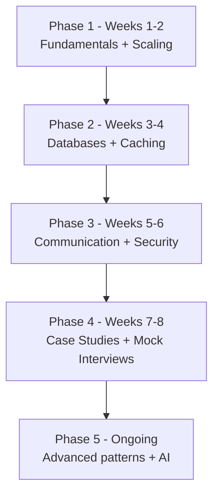

# Master System Design in 2026 — সম্পূর্ণ Roadmap

> 📐 ডায়াগ্রাম — নিজের বোঝার জন্য যোগ করা



নিচের ৯টা topic এলোমেলোভাবে পড়ার জিনিস নয় — এদের একটা **নির্ভরতার ক্রম** আছে, আর এই ডায়াগ্রামটা সেই ক্রমটাই সপ্তাহ ধরে সাজায়। ভিত্তি (CAP, scaling) আগে, কারণ পরের সবকিছু এর ওপর দাঁড়ায়; database ও caching তারপর, কারণ case study-তে এগুলোই বারবার লাগে; case study ও mock interview শেষের দিকে, কারণ ততক্ষণে টুকরোগুলো জোড়া দেওয়ার মতো ভিত্তি তৈরি। Advanced pattern আর AI ইচ্ছাকৃতভাবে "ongoing" — এগুলো একবারে শেষ হয় না।

---

## 1. System Design Fundamentals (ভিত্তি)

**Topics**:
- What is System Design? (কেন দরকার, কীভাবে approach করতে হয়)
- Monolith vs Microservices
- Horizontal vs Vertical Scaling
- Latency vs Throughput
- CAP Theorem ও Trade-offs

**Learning Resources**:
- Learn with Rocky (YouTube)
- Tech Dummies Guide
- System Design Primer (GitHub — kamranahmedse)
- Educative.io

---

## 2. Services-এর মধ্যে Communication

**Topics**:
- API Design Principles (RESTful best practices)
- REST vs gRPC vs GraphQL
- WebSockets ও Long Polling
- Message Queues (Async communication)
- Protocol Buffers

**Tools**: Postman, Apache Kafka, Swagger, RabbitMQ, gRPC

---

## 3. Load Balancing ও Traffic Management

**Topics**:
- Load Balancing Algorithms (Round Robin, Least Connections, IP Hash)
- Global Load Balancers
- DNS-based Distribution
- Rate Limiting
- Circuit Breakers

**Tools**: NGINX, HAProxy, AWS ELB/GCP Load Balancer, Envoy, Cloudflare

---

## 4. Database ও Storage Design

**Topics**:
- SQL vs NoSQL
- Sharding ও Replication
- Caching Strategies
- Consistency Models (Strong, Eventual, Causal)
- Backup ও Recovery

**Tools**: PostgreSQL, MySQL, MongoDB, Cassandra, Redis, DynamoDB, Amazon RDS

---

## 5. Caching ও CDN Strategies

**Topics**:
- Write-through ও Write-around Cache
- Cache Invalidation (সবচেয়ে কঠিন সমস্যা!)
- CDN for Static Content
- Cache Hierarchy
- TTL ও Eviction Policies (LRU, LFU, FIFO)

**Tools**: Redis, Fastly, Varnish, Akamai, Cloudflare CDN

---

## 6. Scalability ও Fault Tolerance

**Topics**:
- Auto-scaling (horizontal ও vertical)
- Failover Systems
- Health Checks ও Heartbeats
- Leader Election
- Redundancy Planning

**Tools**: Kubernetes HPA, Consul, AWS Auto Scaling, Zookeeper, Terraform

---

## 7. Observability ও Monitoring

**Topics**:
- Logging
- Metrics
- Distributed Tracing (OpenTelemetry)
- Alerting Systems
- Real-time Dashboards
- Log Aggregation

**Tools**: Prometheus, Grafana, ELK Stack, Datadog, New Relic

---

## 8. Security ও Reliability

**Topics**:
- Secure API Design
- Authentication ও Authorization
- Encryption in Transit ও at Rest
- Rate Limiting ও Abuse Prevention
- Chaos Engineering

**Tools**: OAuth2/JWT, HashiCorp Vault, Open Policy Agent, Chaos Monkey, Snyk

---

## 9. Real-World System Design Patterns (Advanced)

**Topics**:
- Event-Driven Architecture
- CQRS (Command Query Responsibility Segregation)
- Event Sourcing
- Saga Pattern (distributed transactions)
- Backend for Frontend (BFF)
- Service Mesh

**Tools**: Kafka, Apache Flink, Istio, NATS, Temporal.io

---

## শেখার ক্রম পরামর্শ

```
Phase 1 (Weeks 1-2):  Fundamentals + Scaling basics
Phase 2 (Weeks 3-4):  Databases + Caching
Phase 3 (Weeks 5-6):  Communication + Security
Phase 4 (Weeks 7-8):  Case Studies + Mock Interviews
Phase 5 (Ongoing):    Advanced patterns + AI systems
```
