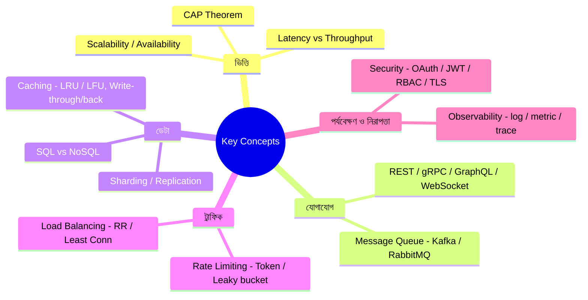

# Mastering System Design: Key Concepts, Tools & Best Practices
*Created by: Rocky Bhatia*

Interview-এর আগে এই concepts গুলো মুখস্থ না করে **বুঝে** রাখো।

> 📐 ডায়াগ্রাম — নিজের বোঝার জন্য যোগ করা



এই ১০টা section আসলে একটা **checklist যা যেকোনো system design প্রশ্নে ঘুরেফিরে আসে** — তাই আলাদা করে না দেখে দলবদ্ধভাবে মনে রাখা সহজ। প্রতিটা ডাল ইন্টারভিউয়ের একটা করে সাধারণ প্রশ্নের সাথে মেলে: "কীভাবে scale করবে" (ভিত্তি + ডেটা), "সার্ভিসগুলো কীভাবে কথা বলবে" (যোগাযোগ), "traffic কীভাবে সামলাবে" (ট্রাফিক), "কীভাবে জানবে system সুস্থ" (পর্যবেক্ষণ)। নিচের cheat sheet-টা এই concept-গুলো কোন ক্রমে বলতে হয় সেটাই দেখায়।

---

## 1. Fundamentals — ভিত্তি

| Concept | সংজ্ঞা |
|---------|---------|
| **Scalability** | Load বাড়লেও performance ঠিক রাখার ক্ষমতা |
| **Availability** | System কতটুকু সময় চালু থাকে (99.9% = 8.7 hrs/year downtime) |
| **Reliability** | সঠিক ফলাফল নির্ভরযোগ্যভাবে দেওয়ার ক্ষমতা |
| **Latency** | একটা request-এর response আসতে কত সময় (ms) |
| **Throughput** | প্রতি সেকেন্ডে কতটা কাজ হয় (RPS, QPS) |
| **CAP Theorem** | Consistency, Availability, Partition Tolerance — যেকোনো ২টা |

---

## 2. API ও Communication

| Type | কীভাবে কাজ করে | কখন ব্যবহার |
|------|----------------|------------|
| **REST** | HTTP methods (GET/POST/PUT/DELETE), stateless | সাধারণ web APIs |
| **GraphQL** | Client নিজে query করে কী data দরকার | Flexible frontend needs |
| **gRPC** | Protocol Buffers, binary format, fast | Microservices internal |
| **WebSockets** | Two-way real-time connection | Chat, live updates |

---

## 3. Databases

**SQL vs NoSQL**:
- **SQL** (MySQL, PostgreSQL): Structured, ACID, joins সম্ভব
- **NoSQL** (MongoDB, Cassandra): Flexible schema, horizontal scaling

**Scaling patterns**:
- **Vertical**: বড় server কিনো (limit আছে)
- **Horizontal/Sharding**: অনেক server, data ভাগ করো
- **Replication**: Master writes, Slaves reads — read performance

---

## 4. Caching Strategies

| Strategy | কীভাবে | Trade-off |
|----------|--------|-----------|
| **Write-Through** | Cache + DB একসাথে write | Slow write, strong consistency |
| **Write-Back** | Cache-এ লেখো, পরে DB | Fast write, data loss risk |
| **FIFO** | পুরোনো first, বাদ দাও | Simple |
| **LRU** | সবচেয়ে কম recently ব্যবহৃত বাদ দাও | Most common |
| **LFU** | সবচেয়ে কম frequently ব্যবহৃত বাদ দাও | Frequency-aware |

---

## 5. Load Balancing Algorithms

| Algorithm | কীভাবে | কখন |
|-----------|--------|------|
| **Round Robin** | একে একে সব server-এ | Uniform requests |
| **Least Connections** | কম connection-এর server-এ | Varying request times |
| **Consistent Hashing** | Hash দেখে নির্দিষ্ট server-এ | Cache hit maximize |
| **IP Hashing** | Client IP দেখে | Session affinity |

---

## 6. Rate Limiting — Traffic Control

| Algorithm | কীভাবে কাজ করে |
|-----------|----------------|
| **Token Bucket** | Bucket-এ token জমে, request আসলে token খরচ হয় |
| **Leaky Bucket** | Request queue-এ জমে, নির্দিষ্ট rate-এ process হয় |
| **Sliding Window** | শেষ N সেকেন্ডে কতটা request — dynamic |

---

## 7. Observability — পর্যবেক্ষণ

**তিনটা স্তম্ভ**:
- **Logging**: কী হয়েছিল? (ELK Stack, Splunk)
- **Metrics**: কত দ্রুত, কতটুকু? (Prometheus, Grafana)
- **Tracing**: কোন সার্ভিসে কত সময় লাগলো? (Jaeger, Zipkin)

---

## 8. Message Queue

| Tool | কখন |
|------|------|
| **Kafka** | High-volume real-time streams, event sourcing |
| **RabbitMQ** | Async task queue, microservices |
| **Pub/Sub** | Event-driven decoupling |

---

## 9. Security Best Practices

- **DDoS Protection**: Rate limiting, Cloudflare
- **Authentication**: OAuth2, JWT, SSO
- **Authorization**: RBAC (Role-Based), ABAC (Attribute-Based)
- **Encryption**: SSL/TLS in transit, AES-256 at rest

---

## 10. Storage Types

| Type | উদাহরণ | কখন |
|------|---------|------|
| **Block Storage** | EBS, SSD | Database volumes |
| **Object Storage** | AWS S3, GCP | Files, images, backups |
| **File Storage** | NFS, SMB | Shared file systems |

---

## Interview Cheat Sheet

```
যেকোনো system design-এ এই order মেনে চলো:

1. Requirements clarify করো (5 min)
2. Scale estimate করো — users, QPS, storage (5 min)
3. High-level diagram আঁকো (10 min)
4. Deep-dive করো একটা critical component-এ (15 min)
5. Trade-offs নিয়ে কথা বলো (5 min)
```
