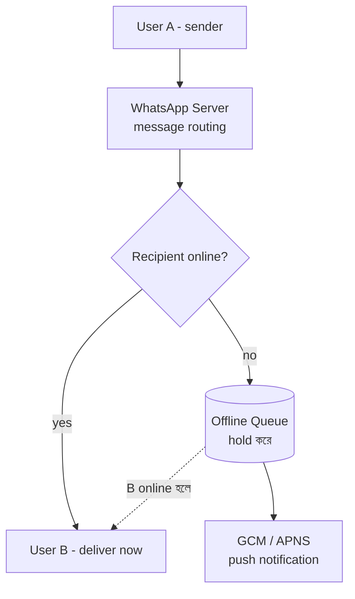
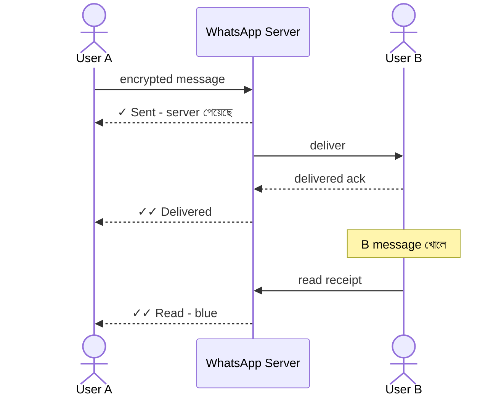

# How WhatsApp Works?
*Created by: Rocky Bhatia*

WhatsApp-এ একটা message পাঠানো থেকে deliver হওয়া পর্যন্ত ধাপে ধাপে কী হয়:

---

## High-Level Design

> 📐 ডায়াগ্রাম — নিজের বোঝার জন্য যোগ করা



মূল সিদ্ধান্তটা ঐ `Recipient online?` শাখায়। WhatsApp server নিজে message-এর স্থায়ী ভাণ্ডার নয় — recipient online থাকলে সাথে সাথে পাঠিয়ে দেয়, offline থাকলে শুধু **অস্থায়ীভাবে** queue-তে ধরে রাখে এবং push notification পাঠায়। deliver হয়ে গেলে server থেকে message মুছে যায়; স্থায়ী কপি থাকে ব্যবহারকারীর নিজের device-এ (SQLite)।

---

## Low-Level Design

> 📐 ডায়াগ্রাম — নিজের বোঝার জন্য যোগ করা

**একটা message-এর জীবনচক্র — sent → delivered → read:**



এই ডায়াগ্রামটা message-এর চারটে state-কে ঘটনার ক্রমে সাজায়। খেয়াল করুন প্রতিটা tick আসলে একটা **আলাদা ack-এর ফল** — `✓` মানে server পেয়েছে, `✓✓` মানে B-র device পেয়েছে, নীল `✓✓` মানে B আসলে খুলেছে। tick গুলো UI-এর সাজসজ্জা নয়, প্রতিটার পেছনে একটা করে network round-trip আছে।

---

## Message Flow — সাধারণ পরিস্থিতি

```
1. User A → WhatsApp-এ message টাইপ করে Send চাপে
2. Message → WhatsApp Server-এ encrypted হয়ে যায়
3. Server → Recipient (User B) online কিনা check করে

4. User B online:
   → Message instantly deliver হয়
   → User B-কে Delivered ✓✓ notification

5. User B offline:
   → Message server-এ hold করা হয় (queue)
   → User B online হলে → deliver করা হয়

6. Recipient-এর সব connected devices-এ sync হয়
7. User B message দেখে → Read receipt পাঠায়
8. User A → Blue ✓✓ দেখে জানে message পড়া হয়েছে
9. Message lifecycle সম্পূর্ণ
```

---

## Message States

| State | Symbol | মানে |
|-------|--------|------|
| Sending | ⏳ | Server-এ পাঠানো হচ্ছে |
| Sent | ✓ | Server receive করেছে |
| Delivered | ✓✓ | Recipient-এর device-এ পৌঁছেছে |
| Read | ✓✓ (blue) | Recipient message দেখেছে |

---

## Advanced Features

### Group Chat Sync
- Group-এর প্রতিটা member-এর কাছে message পাঠানো হয়
- Server পৌঁছানোর সাথে সাথে সব member-এর device-এ sync হয়
- Group-এর delivery receipt individual member-ভিত্তিক

### Push Notifications
- User app-এ না থাকলে push notification পাঠানো হয়
- GCM (Google — Android) বা APNS (Apple — iOS) ব্যবহার হয়
- Notification → User tap করলে → app open হয় → message sync

### End-to-End Encryption (E2EE)
- **Signal Protocol** ব্যবহার করে
- Message শুধু Sender ও Recipient পড়তে পারে
- WhatsApp server-ও message-এর content দেখতে পারে না
- প্রতিটা conversation-এর আলাদা encryption key

---

## Design Points

**Scalability**:
- WhatsApp ২০২২ সালে ২ billion+ users handle করে
- XMPP protocol ব্যবহার করে real-time messaging
- Erlang/Elixir দিয়ে millions of concurrent connections

**Reliability**:
- Message delivery guarantee — offline users-এর জন্য queue
- Multiple retries with backoff
- Read receipts optional (privacy settings)

**Storage**:
- Messages locally device-এ store হয় (SQLite)
- Server শুধু delivery পর্যন্ত hold করে, delivered হলে সরায়
- Media files আলাদা storage-এ
