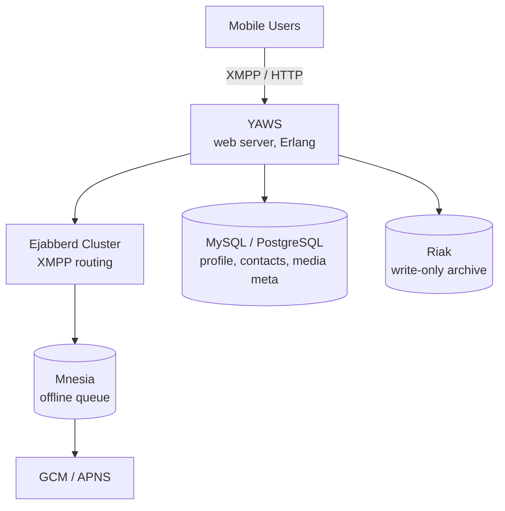
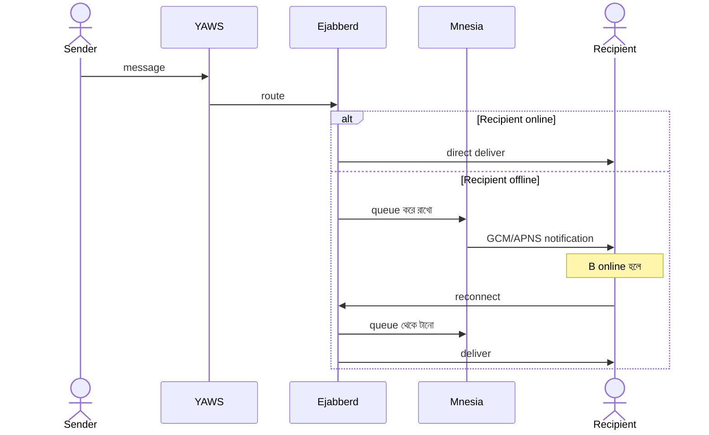

# WhatsApp Architecture — Technical Deep Dive
*Created by: Rocky Bhatia*

WhatsApp-এর আসল technical stack যা millions of users handle করে:

---

## High-Level Design

> 📐 ডায়াগ্রাম — নিজের বোঝার জন্য যোগ করা



প্রতিটা ডেটাবেস **আলাদা কাজের জন্য** — এটাই এই আর্কিটেকচারের মূল শিক্ষা। MySQL structured relational data (profile, contacts); Riak write-heavy archive যেখানে availability > consistency; Mnesia (Erlang-এর in-memory DB) শুধু offline message queue, কারণ সেখানে গতি সবচেয়ে জরুরি। একটা সর্বজনীন DB দিয়ে তিনটে কাজ করতে গেলে কোনোটাই ভালো হতো না।

---

## Low-Level Design

> 📐 ডায়াগ্রাম — নিজের বোঝার জন্য যোগ করা

**Online বনাম offline — একই sender, দুটো ভিন্ন পথ:**



`alt` ব্লকটাই আসল গল্প — routing লজিক একটাই (`Ejabberd`), কিন্তু recipient-এর অবস্থা অনুযায়ী দুটো সম্পূর্ণ ভিন্ন পথ নেয়। online path-এ Mnesia ছোঁয়াই হয় না; offline path-এ Mnesia buffer হিসেবে কাজ করে যতক্ষণ না recipient ফিরে আসে। এই দুই পথ আলাদা রাখাই system-টাকে সরল রাখে।

---

## Architecture Overview

```
Mobile Users
    ↕ (XMPP/HTTP)
YAWS Server (Web Server)
    ├──→ MySQL/PostgreSQL (Media, Profile, Contacts data)
    ├──→ Riak (Write-only Message Archive)
    └──→ Custom Ejabberd Cluster
                ↕
           Mnesia DB Cluster (Offline Users-এর জন্য)
                ↓
         GCM / APNS (Push Notifications)
```

---

## মূল Components

### YAWS (Yet Another Web Server)
- Erlang-এ লেখা high-performance web server
- XMPP ও HTTP উভয় protocol support করে
- Millions of concurrent connections handle করতে সক্ষম
- Erlang-এর "lightweight processes" দিয়ে massive concurrency

### MySQL/PostgreSQL
- User profiles, contacts, media metadata store করে
- Structured, relational data-র জন্য
- Photo, video metadata (actual files আলাদায় থাকে)

### Riak (Write-Only Message Archive)
- **Write-only** — message archive-এর জন্য
- Key-value store, distributed, highly available
- AP (Availability + Partition Tolerance) — CAP Theorem
- বড় scale-এ write-heavy workload handle করতে ভালো

### Custom Ejabberd Server Cluster
- XMPP (Extensible Messaging and Presence Protocol) server
- Open-source কিন্তু heavily customized
- Erlang-এ লেখা — fault-tolerant, distributed
- Real-time message routing handle করে

### Mnesia DB Cluster
- Erlang-এর built-in distributed database
- **Offline users-এর জন্য message queue** করে রাখে
- User online হলে Mnesia থেকে deliver করা হয়
- In-memory + disk storage, very fast

### GCM/APNS (Push Notifications)
- **GCM** (Google Cloud Messaging): Android devices
- **APNS** (Apple Push Notification Service): iOS devices
- Mnesia থেকে → Push notification পাঠানো হয়

---

## Data Flow বিশদ

### Online User-এর জন্য
```
Sender → YAWS → Ejabberd → Recipient-এর YAWS connection → Delivered
                         → MySQL (metadata update)
                         → Riak (archive)
```

### Offline User-এর জন্য
```
Sender → YAWS → Ejabberd → Mnesia (hold করে রাখে)
                         → GCM/APNS (notification পাঠায়)
                         
Recipient online হলে:
Ejabberd → Mnesia থেকে message বের করে → Deliver
```

---

## কেন Erlang?

WhatsApp Erlang বেছে নিয়েছিল কারণ:
- **Concurrency**: লক্ষ লক্ষ simultaneous connections
- **Fault Tolerance**: একটা process crash করলে বাকিগুলো চলে
- **Hot code loading**: server না নামিয়ে code update
- **Distributed**: cluster বানানো সহজ

---

## Scale Metrics

- **১ জন Erlang engineer** ২ billion users-এর জন্য infrastructure চালিয়েছে
- Peak: **১০০ billion messages/day**
- Server per user ratio: Industry-এর সবচেয়ে কম

---

## Key Design Lessons

1. **Protocol চয়ন গুরুত্বপূর্ণ** — XMPP real-time messaging-এর জন্য perfect
2. **Right language** — Erlang-এর concurrency model WhatsApp-এর জন্য ideal
3. **Different DB for different needs** — MySQL (structured), Riak (write-heavy), Mnesia (queue)
4. **Keep it simple** — অল্প engineers দিয়ে বিশাল scale
