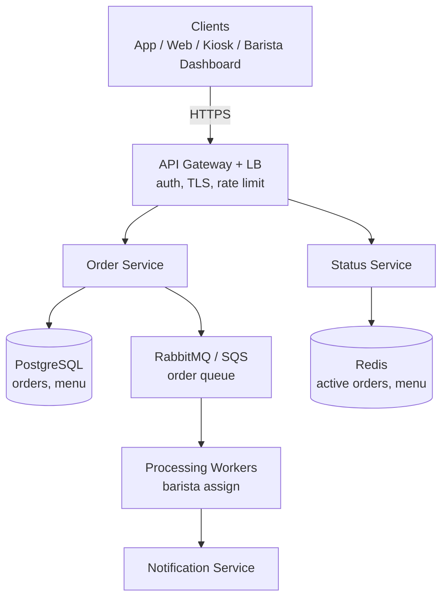
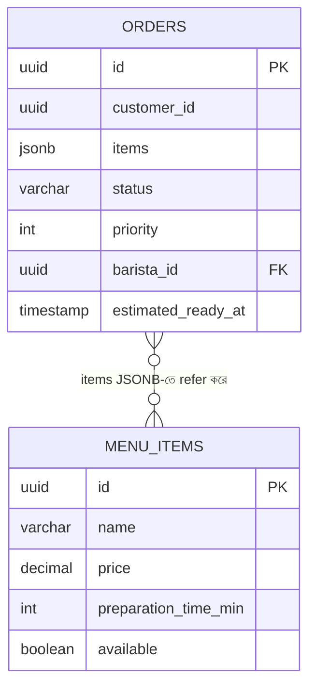
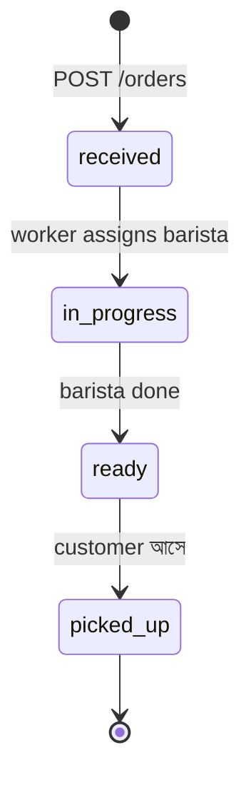

# Coffee Shop Order Management System
*By: Puneet Patwari, Principal Software Engineer @ Atlassian*

Interview-এ অনেক common এই ধরনের "practical small-scale system" design। এটা সম্পূর্ণভাবে solve করা শেখো।

---

## Functional Requirements (কী কী করবে)

1. ✅ Customer-এর order accept ও validate করা
2. ✅ Order-এর status track করা: `received → in-progress → ready → picked-up`
3. ✅ Barista ও customer উভয়কে status জানানো
4. ✅ Priority handling (VIP বা pre-order)
5. ✅ Order সময়মতো সম্পন্ন না হলে alert
6. ✅ Menu ও pricing manage করা

---

## Non-Functional Requirements (কীভাবে করবে)

- **Latency**: Order placement < 200ms
- **Availability**: 99.9% uptime
- **Capacity**: ৫ barista, ঘণ্টায় শত শত order
- **Peak Hours**: Auto-scaling
- **Failure Handling**: Notification fail হলে graceful degradation
- **Consistency**: Order data consistent থাকতে হবে
- **Concurrent Users**: Peak-এ 1000+ simultaneous

---

## High-Level Design

> 📐 ডায়াগ্রাম — নিজের বোঝার জন্য যোগ করা



এই ছোট system-টার আসল কৌশল হলো order নেওয়া আর order বানানোকে **queue দিয়ে আলাদা করা**। Order Service শুধু order-টা DB-তে লিখে queue-তে ফেলে সাথে সাথে customer-কে confirmation দেয় (< 200ms) — barista কখন সেটা তুলবে তার জন্য অপেক্ষা করে না। সকাল ৮-১০টার ভিড়ে হঠাৎ order বাড়লে queue সেটা শুষে নেয়, service crash করে না।

---

## Low-Level Design

> 📐 ডায়াগ্রাম — নিজের বোঝার জন্য যোগ করা

**ডেটা মডেল** (নিচের `## Database Schema`-এর ভিজ্যুয়াল রূপ):



**Order-এর status যেভাবে বদলায়:**



দুটো ডায়াগ্রাম দুটো ভিন্ন প্রশ্নের উত্তর দেয়। ER দেখায় ডেটা **কীভাবে সাজানো** — লক্ষ করুন `items` একটা JSONB কলাম, অর্থাৎ একটা order-এ একাধিক menu item নমনীয়ভাবে রাখা যায় আলাদা junction table ছাড়াই। state diagram দেখায় একটা order **কোন ক্রমে** এগোয় — এই চারটে state-ই `orders.status` কলামের বৈধ মান, আর প্রতিটা রূপান্তর একটা নির্দিষ্ট ঘটনায় ঘটে (customer, worker, বা barista-র action)।

---

## Architecture

```
Client Layer
├── Mobile App (Customer)
├── Web Browser (Customer)
├── In-Shop Kiosk
└── Barista Dashboard

        ↓ HTTPS

API Gateway + Load Balancer (AWS ELB/NGINX)
(Authentication, SSL/TLS, Rate Limiting)

        ↓

Microservices Core
├── Order Service         → Order তৈরি, update, query
├── Status Service        → Order status track
├── Notification Service  → Customer/Barista notify
├── Order Processing Workers (Barista Assignment)
└── Resource Manager Service

        ↓

Data Layer
├── PostgreSQL/RDS  → Primary database (orders, menu)
├── Redis/Memcached → Cache (popular items, active orders)
└── RabbitMQ/SQS    → Message queue (order processing)
```

---

## Database Schema

```sql
-- Orders Table
CREATE TABLE orders (
  id UUID PRIMARY KEY,
  customer_id UUID,
  items JSONB,
  status VARCHAR(20),  -- received/in-progress/ready/picked-up
  priority INT DEFAULT 0,
  created_at TIMESTAMP,
  estimated_ready_at TIMESTAMP,
  barista_id UUID
);

-- Menu Items
CREATE TABLE menu_items (
  id UUID PRIMARY KEY,
  name VARCHAR(100),
  price DECIMAL(10,2),
  preparation_time_min INT,
  available BOOLEAN
);
```

---

## API Design

```
POST /orders          → নতুন order তৈরি
GET  /orders/{id}     → order details
PUT  /orders/{id}/status → status update
GET  /orders?status=in-progress → active orders (barista view)
GET  /menu            → available items
```

---

## Order Flow

```
Customer → POST /orders
         → Order Service validates
         → Order saved to DB
         → RabbitMQ queue-এ push
         → Customer-কে confirmation (order ID, estimated time)

Worker → Queue থেকে order নেয়
       → Barista assign করে
       → Status: in-progress
       → Barista Dashboard update

Barista → Order তৈরি হলে → Status: ready
        → Notification Service trigger
        → Customer-কে SMS/Push notification

Customer → এসে order picks up → Status: picked-up
```

---

## Key Improvements

| Improvement | কেন |
|------------|-----|
| **Auto-Scaling** | Peak hours (সকাল ৮-১০) এ traffic হঠাৎ বাড়ে |
| **CDN + Caching** | Menu data (কম বদলায়) cache করো |
| **Read Replicas** | Order history queries → replica থেকে |
| **Sharding by Location** | Multi-branch হলে branch-ভিত্তিক shard |
| **Circuit Breaker** | Notification service fail হলে order fail করো না |
| **Queue Buffering** | হঠাৎ বেশি order আসলে queue-এ রাখো |
| **Event Batching** | Analytics-এর জন্য events batch করো |
| **Analytics Data Lake** | S3-এ order history → business insights |

---

## Interview-এ কীভাবে present করবে

1. **Requirements clarify করো**: "শুধু coffee shop, নাকি multi-branch chain?"
2. **Scale estimate**: "দিনে কত orders? Peak hour কখন?"
3. **HLD diagram আঁকো**: Client → API → Services → DB
4. **একটা flow বিস্তারিত বলো**: "Order placement এভাবে কাজ করে..."
5. **Trade-offs বলো**: "Redis cache use করলে staleness issue হতে পারে, এভাবে handle করবো..."
