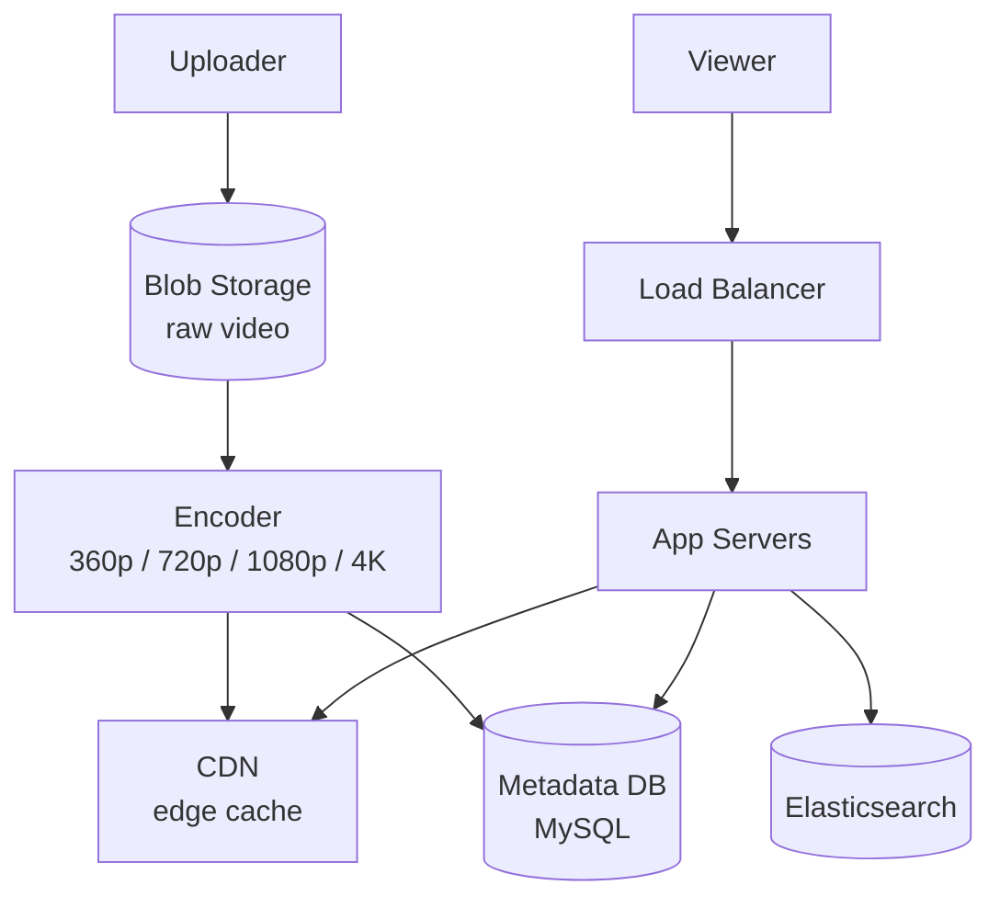
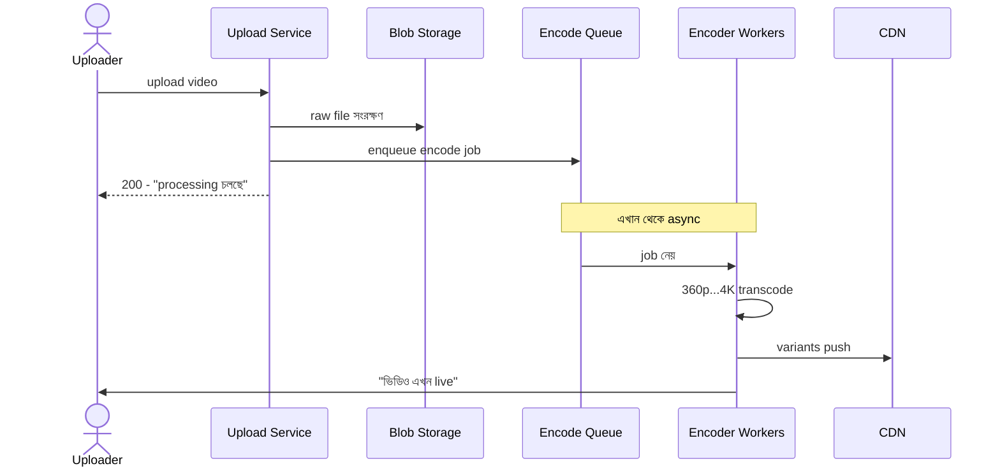

# YouTube System Design
*Created by: Rocky Bhatia*

YouTube — বিশ্বের সবচেয়ে বড় video platform — প্রতি মিনিটে ৫০০ ঘণ্টার video upload হয়।

---

## High-Level Design

> 📐 ডায়াগ্রাম — নিজের বোঝার জন্য যোগ করা



সবচেয়ে গুরুত্বপূর্ণ কথা — **upload path আর playback path সম্পূর্ণ আলাদা**। Upload একবার ঘটে কিন্তু ভারী (transcoding মিনিট লাগে); playback কোটি কোটি বার ঘটে কিন্তু হালকা হওয়া চাই। তাই আপলোডের ভারী কাজ (encoding) আগে থেকে সেরে ফলাফল CDN-এ রেখে দেওয়া হয়, যাতে দর্শক কখনো transcoder-এর জন্য অপেক্ষা করে না — সরাসরি edge থেকে video পায়।

---

## Low-Level Design

> 📐 ডায়াগ্রাম — নিজের বোঝার জন্য যোগ করা

**Upload কেন synchronous করা যায় না — async transcoding pipeline:**



লক্ষ করুন — **transcode শেষ হওয়ার আগেই uploader 200 পেয়ে যায়**। ৪K encoding-এ কয়েক মিনিট লাগতে পারে; সেটার জন্য HTTP request আটকে রাখলে connection timeout হবে আর একটা worker পুরো সময় বাঁধা পড়ে থাকবে। তাই কাজটা queue-তে ফেলে "processing চলছে" বলে দেওয়া হয়, worker আলাদাভাবে শেষ করে জানায়।

---

## Upload Flow (ভিডিও আপলোড)

```
User → Upload Video
     ↓
Blob Storage (raw video)
     ↓
Encoder (transcoding)
  → 360p, 720p, 1080p, 4K variants তৈরি
     ↓
Temp Storage
     ↓
Cache → Video Metadata (title, description, tags)

Queuing Services → Notification Service
(আপলোড complete হলে subscribers-কে notify)
```

**কেন multiple formats?**
- বিভিন্ন device ও internet speed-এর জন্য
- Adaptive bitrate streaming — connection অনুযায়ী quality বদলায়

---

## Request Flow (ভিডিও দেখা)

```
User → DNS → Load Balancer → Web Server → App Server
                                         ↓
                                    Core Services:
                                    ├── Upload Service
                                    ├── Search Service
                                    └── Comments Service
```

---

## Core Services Detail

### Search Service
- Elasticsearch দিয়ে full-text search
- Title, description, tags index করা
- Autocomplete, spell correction

### Recommendation Engine (AI-চালিত)
```
User History + Videos Watched + Liked Videos + Watch Time
                    ↓
           Ranking Algorithm
                    ↓
        Personalized recommendations
```
- **Collaborative filtering**: অন্যান্য similar users কী দেখেছে
- **Content-based**: video features দেখে
- Adaptive algorithm — real-time feedback নেয়

---

## Data Layer

```
Video Metadata → Replication → Shard (Primary MySQL)
                    ↓
              Read Replicas (search/browse queries)
```

- **MySQL**: Video metadata (title, views, likes, channel info)
- **Bigtable/Cassandra**: View counts (high-write)
- **Blob Storage (GCS/S3)**: Actual video files
- **CDN (Akamai/Fastly)**: Video delivery edge-এ cache

---

## Scale Challenges

| Challenge | Solution |
|-----------|----------|
| Video encoding সময় বেশি | Async processing queue |
| Billions of views count | Eventually consistent counter (Bigtable) |
| Global users, high latency | CDN + edge caching |
| Search on millions of videos | Elasticsearch sharding |
| Recommendation freshness | Near-real-time ML pipeline |

---

## Observability

- প্রতিটা service-এর health metrics track করা হয়
- Video playback errors, buffering rate monitor করা হয়
- A/B testing — নতুন recommendation algorithm চালু করার আগে

---

## Interview Key Points

1. **Upload ও playback আলাদা path** — explain করো কেন
2. **CDN-এর ভূমিকা** — video delivery-তে critical
3. **Transcoding async** — কেন synchronous করা যায় না?
4. **Recommendation engine** — simple collaborative filtering দিয়ে শুরু করো, তারপর ML বলো
5. **Scale**: "YouTube প্রতিদিন ১ billion hours video watch হয়" — estimate করো
