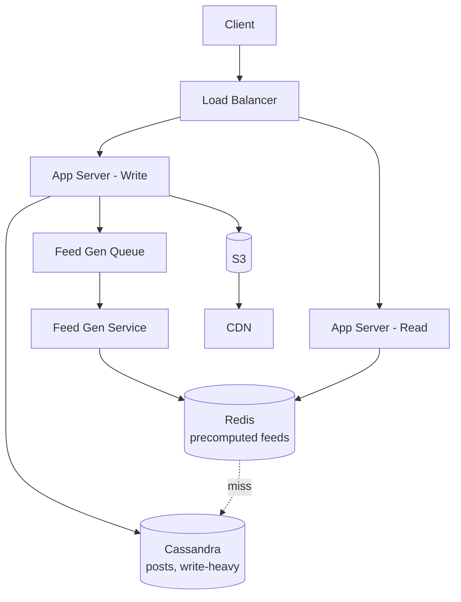
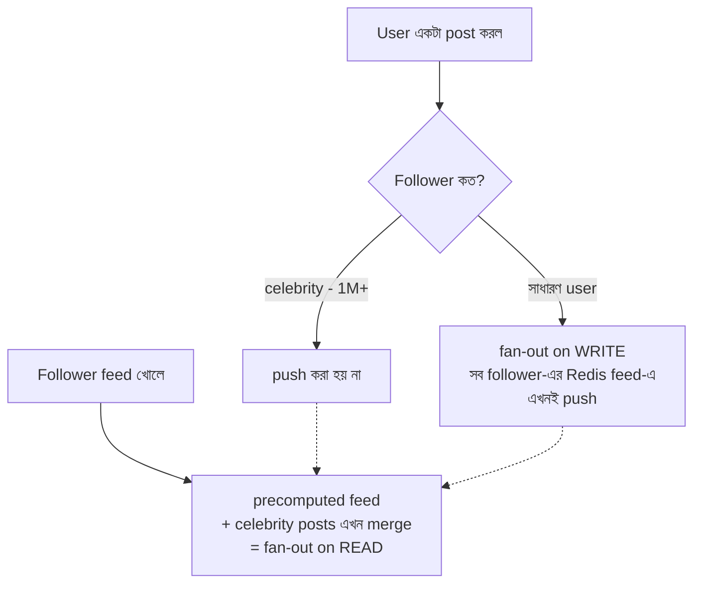

# Instagram System Design
*Created by: Rocky Bhatia*

Instagram — Photo/Video sharing social platform। Key challenges: বিশাল media storage, personalized feed generation, global scale।

---

## High-Level Design

> 📐 ডায়াগ্রাম — নিজের বোঝার জন্য যোগ করা



দুটো নকশাগত সিদ্ধান্ত এখানে চোখে পড়ে। এক — **read আর write আলাদা app server**, কারণ Instagram-এ পড়া হয় লেখার চেয়ে বহুগুণ বেশি, দুটোকে আলাদা করলে প্রত্যেকটা স্বাধীনভাবে scale করা যায়। দুই — feed **আগে থেকে বানিয়ে Redis-এ রাখা** (fan-out on write), তাই feed খোলার সময় গণনা করতে হয় না, শুধু cache থেকে পড়া হয়। এর ব্যতিক্রম celebrity — সেটা পরের সেকশনে।

---

## Low-Level Design

> 📐 ডায়াগ্রাম — নিজের বোঝার জন্য যোগ করা

**Fan-out on write বনাম read — celebrity সমস্যা কীভাবে সামলানো হয়:**



মূল সমস্যাটা হলো — একটা celebrity-র ১ কোটি follower থাকলে তার প্রতিটা post-এ ১ কোটি feed আপডেট করা অসম্ভব ব্যয়বহুল। তাই **দুই কৌশল মিশিয়ে** ব্যবহার করা হয়: সাধারণ user-এর post লেখার সময়ই সব follower-এর feed-এ বসিয়ে দেওয়া হয় (write একটু ভারী, কিন্তু read তাৎক্ষণিক); celebrity-র post তার follower-দের feed-এ push করা হয় **না** — বরং follower যখন feed খোলে তখন তার precomputed feed-এর সাথে celebrity-র সাম্প্রতিক post মিশিয়ে দেওয়া হয়। ফলে ১ কোটি write বেঁচে যায়, দাম শুধু read-এ সামান্য বেশি কাজ।

---

## Client Flow (সামগ্রিক)

```
Client → DNS → Load Balancer → API Gateway (1, 2)
                                      ↓
                              App Server (Read/Write)
```

---

## Write Path (Post করা)

```
App Server (Write)
      ↓
Feed Generation Queue
      ↓
Feed Generation Service
      ↓
Newsfeed (followers-দের feed update)
```

**Fan-out on Write**:
- User post করলে সাথে সাথে সব followers-এর feed-এ add হয়
- **সমস্যা**: Celebrity ১ কোটি followers — ১ কোটি feed update!
- **সমাধান**: Celebrity-র জন্য fan-out on read (read করার সময় merge করা)

---

## Read Path (Feed দেখা)

```
App Server (Read)
      ↓
Cache (Redis — precomputed feeds)
      ↓ (cache miss হলে)
Metadata DB (Directory Based Partitioning, Shard Manager)
```

- Popular users-এর posts always cache-এ থাকে
- Cache miss হলে DB থেকে query ও cache update

---

## Media Processing

```
Client → Upload → Blob Storage (S3)
                       ↓
         Video/Image Processing Service
                       ↓
                    Workers
                       ↓
         Video Processing Queue
                       ↓
         Processed Media (multiple sizes/formats)
                       ↓
                      CDN
```

**Image Processing**:
- Multiple resolutions: thumbnail, medium, full
- Format optimization: WebP, AVIF
- Face detection, content moderation (AI)

---

## Search

```
User → Search Query
            ↓
Search Results Aggregators
            ↓
Search Index (Elasticsearch) + Cache
```

- Hashtags, usernames, locations index করা
- Autocomplete suggestion
- Trending topics real-time update

---

## Static Content (CDN)

```
Client ↔ CDN (Images/Videos globally cached)
```
- User-generated content globally edge-এ cache হয়
- Cache-Control headers দিয়ে TTL manage করা হয়

---

## Notification System

```
Notification Service → Notification Queue
                            ↓
                       Client (push/email/SMS)
```

Events যা notification trigger করে:
- কেউ follow করলে
- কেউ like/comment করলে
- Story mention হলে

---

## Database Design

| Data | Storage |
|------|---------|
| User info, follows | PostgreSQL |
| Posts metadata | Cassandra (write-heavy) |
| Feed cache | Redis |
| Media files | S3 + CDN |
| Search index | Elasticsearch |

---

## Interview Key Points

1. **Feed generation** কীভাবে হয় — fan-out on write vs read
2. **Celebrity problem** কীভাবে handle করবে
3. **Media processing async** — কেন synchronous করা যায় না?
4. **Partitioning strategy** — Directory based + Shard Manager
5. **Read/Write separation** — আলাদা app server কেন?
