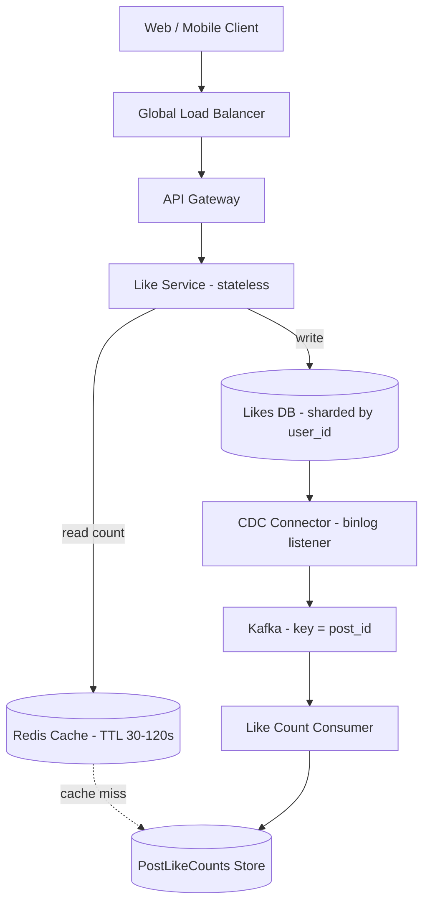
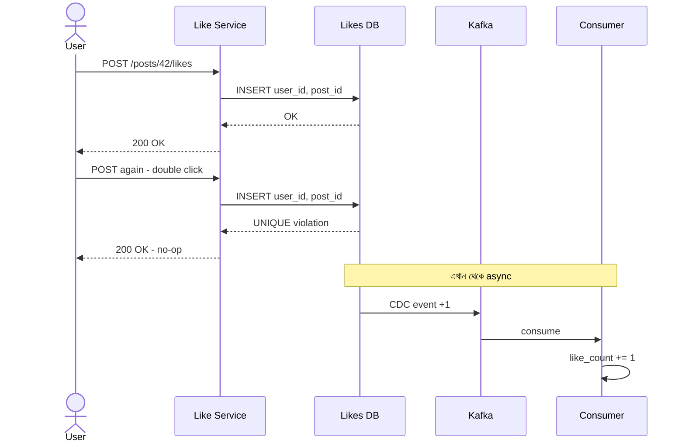
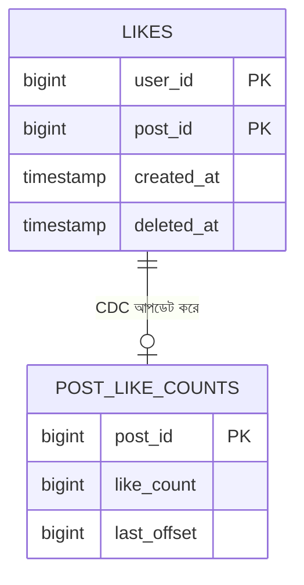

# Design Facebook's Like Button — HLD
*By: Puneet Patwari, Principal Software Engineer @ Atlassian*

"Like button কতটা সহজ?" — আসলে এর পেছনে বিশাল engineering। Billions of likes per day handle করতে হয়।

---

## Requirements

**Functional**:
- User একটা post like/unlike করতে পারবে
- Post-এর like count দেখতে পারবে
- নিজে কোন posts like করেছে দেখতে পারবে (`/likes/me`)

**Non-Functional**:
- Like count-এ eventual consistency acceptable
- Like/unlike idempotent — double click করলে double count হবে না
- High availability, low latency

---

## High-Level Design

> 📐 ডায়াগ্রাম — নিজের বোঝার জন্য যোগ করা



সিস্টেমটা ইচ্ছে করেই **দুই ভাগে** ভাঙা — write path আর count path। Like দেওয়ার সময় Like Service শুধু Likes DB-তে একটা row লেখে, count বাড়ানোর কাজ করে না। কারণ ৫২,০০০ like/second-এ একই `post_id`-র counter synchronously বাড়াতে গেলে সেখানেই lock contention তৈরি হবে।

তাই count আপডেট হয় **অন্য পথে** — DB-র binlog থেকে CDC পড়ে, Kafka-তে পাঠায়, consumer আলাদা store-এ count বসায়। এর দাম হলো eventual consistency (কয়েক সেকেন্ড lag), যা like count-এর জন্য গ্রহণযোগ্য।

পড়ার সময় Redis আগে দেখা হয়; miss হলে PostLikeCounts store থেকে পড়ে cache-এ বসিয়ে দেয়।

---

## Low-Level Design

> 📐 ডায়াগ্রাম — নিজের বোঝার জন্য যোগ করা

**Like দেওয়ার পুরো ক্রম** (double-click সহ):



লক্ষ করুন — **দুবারই ক্লায়েন্ট 200 পায়**। এটাই idempotency: দ্বিতীয় request-টা ব্যর্থ হয়নি, শুধু কিছু বদলায়নি। Constraint violation-কে error হিসেবে ফেরত দিলে UI অকারণে "কিছু ভুল হয়েছে" দেখাত, অথচ ব্যবহারকারীর দিক থেকে কাজটা হয়েই গেছে।

**ডেটা মডেল**:



দুটো ফিল্ড খেয়াল করার মতো। `deleted_at` — unlike করলে row মুছে না দিয়ে soft delete, যাতে analytics-এর জন্য history থাকে। আর `last_offset` — consumer কোন Kafka offset পর্যন্ত প্রক্রিয়া করেছে সেটা count-এর পাশেই রাখা, তাই consumer crash করে restart করলে ঠিক কোথা থেকে শুরু করবে জানে এবং একই event দুবার গুনে ফেলে না।

---

## Write Path (Like দেওয়া)

```
Web/Mobile Client
      ↓ HTTPS
Global Load Balancer
      ↓
API Gateway
      ↓
Like Service (stateless, অনেক instance)
      ↓
POST /posts/{id}/likes   → Like করা
DELETE /posts/{id}/likes → Unlike করা
      ↓
Likes DB (Sharded)
├── Shard A: hash(user_id) % 2 = 0
└── Shard B: hash(user_id) % 2 = 1
```

**Idempotency**:
- `UNIQUE (user_id, post_id)` constraint DB-তে
- Double like → constraint violation → ignore (no-op)
- Non-existing like delete → no-op

---

## CDC & Event Processing (Like Count Update)

```
Likes DB
    ↓ (binlog listener)
CDC Connector
    ↓ Change events
    │  +1 = insert (like)
    │  -1 = delete (unlike)
    ↓
Kafka Cluster (topic: likes_events, key = post_id)
    ↓
Like Count Consumer
    ↓
PostLikeCounts Store (post_id, like_count, last_offset)
```

**CDC (Change Data Capture)**:
- DB-র binlog থেকে সব changes capture করে
- Kafka-তে publish করে
- Consumer asynchronously count update করে
- **Eventual consistency** — কিছুটা lag acceptable

---

## Read Path (Count দেখা)

```
Like Service
    ↓
Redis Cache (key: likes:count:{postId}, TTL: 30-120s)
    ↓ cache miss হলে
PostLikeCounts Store → read → cache set
```

**Read-after-write consistency**:
- `/likes/me` (নিজের likes দেখা) → Likes DB-র leader থেকে read করা হয়
- কারণ: নিজে like দিলে সাথে সাথে দেখতে চায়

---

## Key Design Decisions

| সিদ্ধান্ত | কারণ |
|-----------|------|
| **Idempotent endpoints** | Double-click করলে double count হবে না |
| **Unique constraint** | DB level-এ idempotency enforce |
| **Soft delete (deleted_at)** | Analytics-এর জন্য history রাখা |
| **Rate limiting per user/IP** | Abuse ঠেকানো |
| **Kafka key = post_id** | Same post-এর events ordered থাকে |
| **Redis TTL** | Cache staleness balance করা |
| **CDC approach** | DB-তে extra write load নেই, counting async |

---

## Failure Scenarios

**Kafka/Consumer down হলে**:
- Likes DB-তে সব like ঠিকই আছে
- Consumer recover করলে binlog থেকে catch up করে
- Count eventually correct হবে

**Redis down হলে**:
- PostLikeCounts Store থেকে directly read করো
- Latency একটু বাড়বে কিন্তু system চলবে

---

## Scale Estimates

- Facebook: **৪.৫ billion likes/day**
- = ~52,000 likes/second peak
- Likes DB: hash sharding by user_id
- PostLikeCounts: post_id by sharding
- Redis: distributed cache cluster

---

## Interview Tips

> "Like button design করো" — একটা classic interview question। এটা দেখায় তুমি simple feature-এর complexity বুঝতে পারো।

**যা অবশ্যই বলবে**:
1. Idempotency — double like problem
2. Like count eventual consistency কেন acceptable
3. CDC দিয়ে count update — কেন synchronous করা কঠিন?
4. Cache strategy — Redis TTL
5. Sharding strategy — কোন key-এ?
