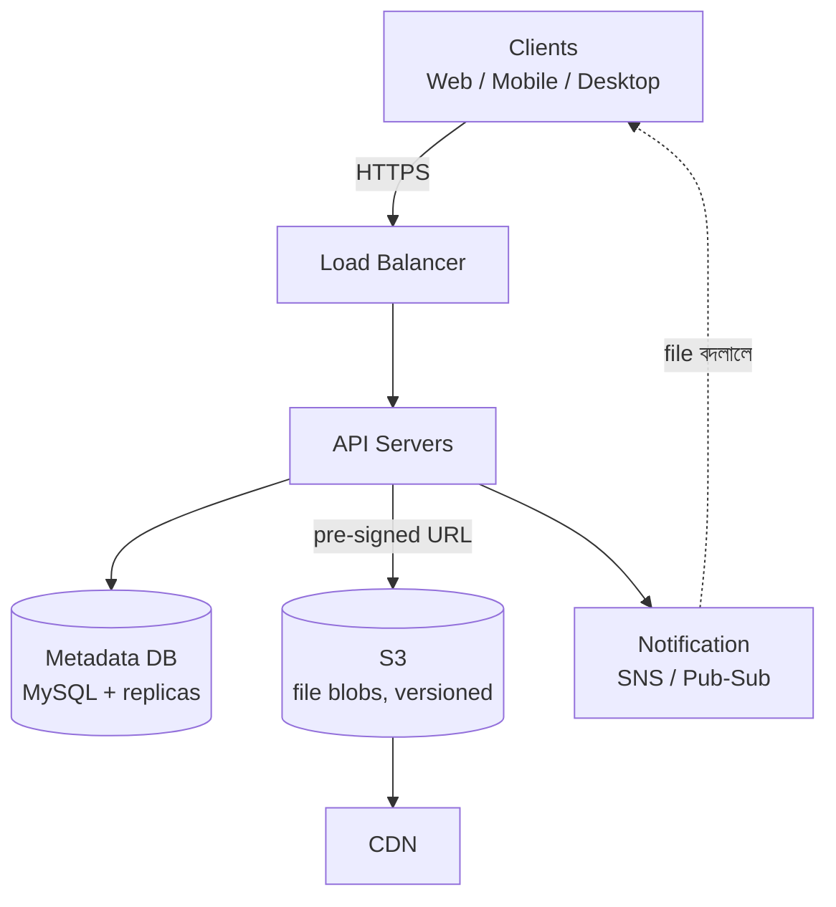
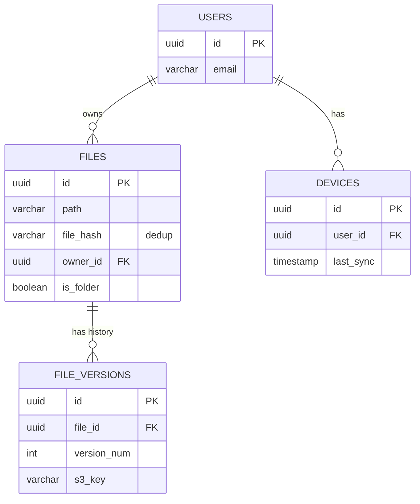

# Design Google Drive
*By: Puneet Patwari, Principal Software Engineer @ Atlassian*

---

## Functional Requirements

- ✅ Files upload (resumable, multipart via S3)
- ✅ Files download (pre-signed URL redirect)
- ✅ Multi-device sync (সব device-এ latest version)
- ✅ Real-time notifications (file update হলে pub/sub)
- ✅ File revision history

---

## Non-Functional Requirements

- **High availability**: সবসময় accessible
- **Consistency**: সব device-এ একই file দেখাবে
- **Low bandwidth**: Client-side compression
- **Multi-platform**: Web, Mobile, Desktop
- **Security**: Client-side encryption

---

## Scale Estimate

| Metric | Value |
|--------|-------|
| Total users | 100M |
| DAU | 1M |
| Storage per user | 15 GB limit |
| Max file size | 10 GB |
| Total storage | ~1.5 PB |
| Average QPS | ~11 |
| Peak QPS | ~20 |
| Daily traffic | 5 TB/day |

---

## High-Level Design

> 📐 ডায়াগ্রাম — নিজের বোঝার জন্য যোগ করা



মূল কৌশলটা হলো — **file-এর bytes কখনো API server-এর ভেতর দিয়ে যায় না**। API server শুধু metadata সামলায় আর একটা pre-signed URL দেয়; আসল ১০GB file ক্লায়েন্ট সরাসরি S3-তে/থেকে upload-download করে। তাই কয়েকটা API server দিয়েই পেটাবাইট-স্কেলের ট্রাফিক সামলানো যায় — ভারী কাজটা S3/CDN-এর ওপর, metadata layer-এর ওপর নয়।

---

## Low-Level Design

> 📐 ডায়াগ্রাম — নিজের বোঝার জন্য যোগ করা

**ডেটা মডেল** (নিচের `## Database Schema`-এর ভিজ্যুয়াল রূপ):



তিনটে ডিজাইন সিদ্ধান্ত এই schema-তে লুকিয়ে। `file_hash` — একই file দুবার এলে dedup করে S3-তে একবারই রাখা হয়। `FILE_VERSIONS` আলাদা টেবিল — `files` row একটাই থাকে, প্রতিটা edit নতুন version হিসেবে জমে, তাই পুরনো version restore করা যায়। আর `DEVICES.last_sync` — প্রতিটা device শেষ কখন sync করেছে জানা থাকে, তাই শুধু তার পরের পরিবর্তনগুলোই পাঠাতে হয়, পুরো drive নয়।

---

## Architecture

```
Clients (Web/Mobile/Desktop)
      ↓ HTTPS
Load Balancer (AWS ELB)
      ↓
API Servers (EC2/ECS)
      ├──→ Metadata DB (Amazon RDS-MySQL) + Read Replicas
      └──→ CDN (CloudFront) ↔ Cloud Storage (Amazon S3)
                                  (Pre-signed URLs, Multipart, Versioning)

Notification Service (AWS SNS/Pub-Sub)
→ Connected devices-কে notify করে
```

---

## Database Schema

```sql
-- Users
CREATE TABLE users (
  id UUID PRIMARY KEY,
  username VARCHAR(100),
  email VARCHAR(255) UNIQUE,
  password_hash VARCHAR(255),
  last_login TIMESTAMP
);

-- Files
CREATE TABLE files (
  id UUID PRIMARY KEY,
  path VARCHAR(500),      -- /root/folder/file.pdf
  file_hash VARCHAR(64),  -- deduplication-এর জন্য
  owner_id UUID REFERENCES users(id),
  is_folder BOOLEAN DEFAULT FALSE,
  size_bytes BIGINT
);

-- File Versions
CREATE TABLE file_versions (
  id UUID PRIMARY KEY,
  file_id UUID REFERENCES files(id),
  version_num INT,
  s3_key VARCHAR(500),
  created_at TIMESTAMP,
  updated_at TIMESTAMP
);

-- Devices (sync-এর জন্য)
CREATE TABLE devices (
  id UUID PRIMARY KEY,
  user_id UUID REFERENCES users(id),
  device_type VARCHAR(50),
  last_sync TIMESTAMP
);
```

---

## Upload Flow

```
1. Client → POST /upload/initiate → multipart upload ID পায়
2. Client → File chunks upload → S3 directly (pre-signed URL)
3. Client → POST /upload/complete → API Server S3 finalize করে
4. API Server → Metadata DB update
5. SNS/Pub-Sub → Other devices-কে notify
6. Other devices → sync করে
```

**Resumable Upload কেন**?
- বড় file (10GB) upload-এ network fail হতে পারে
- Resumable — আবার শুরু থেকে না করে যেখানে থেমেছিল সেখান থেকে

---

## Download Flow

```
Client → GET /files/{id}/download
      → API Server → Pre-signed S3 URL generate করে (15 min validity)
      → Client সরাসরি S3/CDN থেকে download করে
```
API server-এর উপর load কমে — S3 থেকে direct।

---

## Scaling ও Improvements

| Improvement | কেন |
|------------|-----|
| **Multi-Region Replication** | Global users, disaster recovery |
| **Read/Write DB Splitting** | Read queries → Replica |
| **CDN for Downloads** | Popular files edge-এ cache |
| **S3 Key Prefixing** | Hot partition এড়ানো |
| **Conflict Resolution** | ২ device একই file edit করলে → duplicate + timestamp |
| **S3 Versioning** | Auto backup, old version restore |

---

## Interview Key Points

1. **Chunked/Multipart upload** — কেন?
2. **Pre-signed URLs** — API server load কমায়
3. **Deduplication** — `file_hash` দিয়ে same file আবার store করো না
4. **Sync mechanism** — device-এ কীভাবে changes আসে?
5. **Conflict resolution** — Google Docs-এর মতো real-time collaboration না, Google Drive simple versioning
