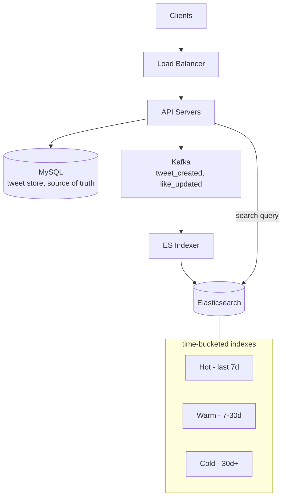
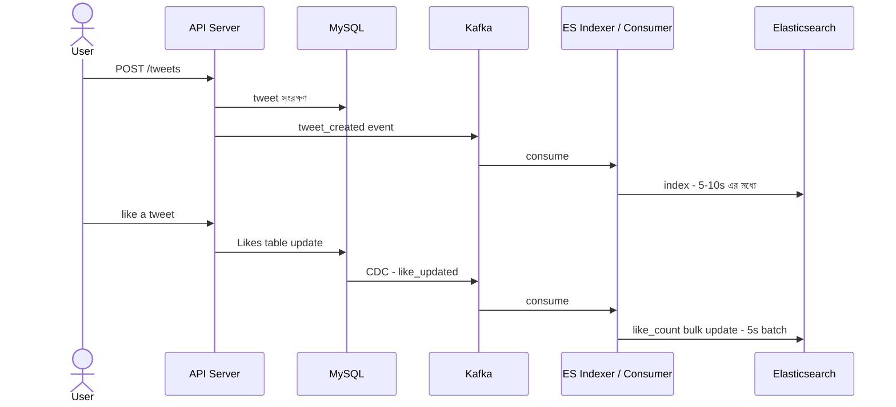

# Design Twitter Search
*By: Puneet Patwari, Principal Software Engineer @ Atlassian*

Twitter Search — Real-time tweet indexing ও querying at massive scale।

---

## Functional Requirements

- ✅ Keyword/hashtag দিয়ে tweet search
- ✅ **Latest results** — সবচেয়ে নতুন আগে (recency sorted)
- ✅ **Top results** — popularity score দিয়ে rank করা
- ✅ Cursor-based pagination (infinite scroll)
- ✅ 5-10 seconds indexing lag acceptable (real-time নয়)

---

## Non-Functional Requirements

| Metric | Value |
|--------|-------|
| Search QPS | 10,000/sec |
| Tweet write rate | 6,000/sec |
| Query latency | < 200ms |
| Total storage | 2 PB |
| Total users | 100M |
| DAU | 1M |
| Tweets/day | 500M |

Like count: eventually consistent (স্বল্প lag acceptable)

---

## High-Level Design

> 📐 ডায়াগ্রাম — নিজের বোঝার জন্য যোগ করা



দুটো ধারণা এখানে মূল। এক — **MySQL হলো source of truth, Elasticsearch নয়**। tweet আগে MySQL-এ লেখা হয়, তারপর Kafka হয়ে asynchronously ES-তে index হয় (৫-১০s lag গ্রহণযোগ্য)। দুই — index **সময় অনুযায়ী hot/warm/cold-এ ভাগ**, কারণ search-এর বেশিরভাগ সাম্প্রতিক tweet-এ; পুরনো tweet সস্তা storage-এ সরিয়ে দিলে hot index ছোট ও দ্রুত থাকে।

---

## Low-Level Design

> 📐 ডায়াগ্রাম — নিজের বোঝার জন্য যোগ করা

**Tweet indexing আর like count — কেন দুটোই async, দুটোই Kafka দিয়ে:**



দুটো path-ই একই নীতি মানে — **DB-তে লেখো, তারপর event পাঠাও, ES পরে ধরুক**। যদি API সরাসরি DB আর ES দুই জায়গায় লিখত, তাহলে একটা সফল আর অন্যটা ব্যর্থ হলে দুটো store চিরতরে অমিল হয়ে যেত (double-write problem)। Kafka মাঝে থাকায় DB-ই একমাত্র সত্য, ES সেটার পিছু নেয়; consumer crash করলেও event Kafka-তে থাকে, recover করে ধরে ফেলে।

---

## Architecture

```
Clients
  ↓
Load Balancer (AWS ELB)
  ↓
API Servers (EC2/ECS)
  ├──→ Metadata DB (RDS-MySQL) + Read Replicas
  └──→ Kafka (tweet_created, like_updated events)
              ↓
         Search Service (Elasticsearch Indexer)
              ↓
         Elasticsearch Cluster
         (document-partitioned, time-bucketed indexes)
         ├── Hot Index   → last 7 days
         ├── Warm Index  → 7-30 days
         └── Cold Index  → 30+ days
```

---

## API Design

```
# Latest tweets search
GET /search/tweets?q={keyword}&sort=latest&cursor={cursor}

# Top tweets search (popularity score)
GET /search/tweets?q={keyword}&sort=top&cursor={cursor}

# Top score formula:
score = likes × 0.6 + views × 0.3 + time_decay × 0.1

# New tweet ingest
POST /tweets
{
  "user_id": "...",
  "content": "Hello #world",
  "media_urls": [...]
}
```

---

## Tweet Indexing Flow

```
User → POST /tweets
            ↓
API Server → MySQL (tweet store)
           → Kafka (topic: tweet_created)
                    ↓
            Elasticsearch Indexer
            → Tweet index করে (within 5-10s)
            → Hashtags, mentions, full-text extract করে
```

---

## Like Count Update

```
User → Like a tweet
     → MySQL Likes table update
     → CDC (Debezium) → Kafka (topic: like_updated)
                              ↓
                      Like Count Consumer
                      → Elasticsearch document update
                      → like_count field update (bulk, 5s batch)
```

**কেন CDC?**: Direct Elasticsearch write করলে double write problem। CDC দিয়ে DB-ই source of truth।

---

## Elasticsearch Optimization

| Strategy | কারণ |
|---------|------|
| **Document Partitioning** | tweet_id দিয়ে — related tweets একসাথে |
| **Time-Based Buckets** | Hot/Warm/Cold — recent tweets fast |
| **Bulk Upsert (5s batch)** | Individual upsert costly, batch ভালো |
| **Query Timeout 200ms** | Slow query kill করে fast response |

---

## Index Structure

```json
{
  "tweet_id": "...",
  "user_id": "...",
  "content": "Hello #world",
  "hashtags": ["world"],
  "created_at": "2026-07-19T...",
  "like_count": 1500,
  "view_count": 25000,
  "score": 9.3
}
```

---

## Interview Key Points

1. **Time-bucketed indexes** — Hot/Warm/Cold কেন?
2. **Score formula** — like+view+recency কীভাবে balance করবে?
3. **CDC for like count** — কেন synchronous update করা কঠিন?
4. **Pagination** — offset কেন না, cursor কেন?
5. **Semantic search (future)** — keyword-এর বদলে meaning বোঝা
