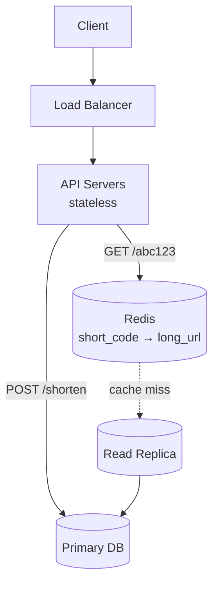
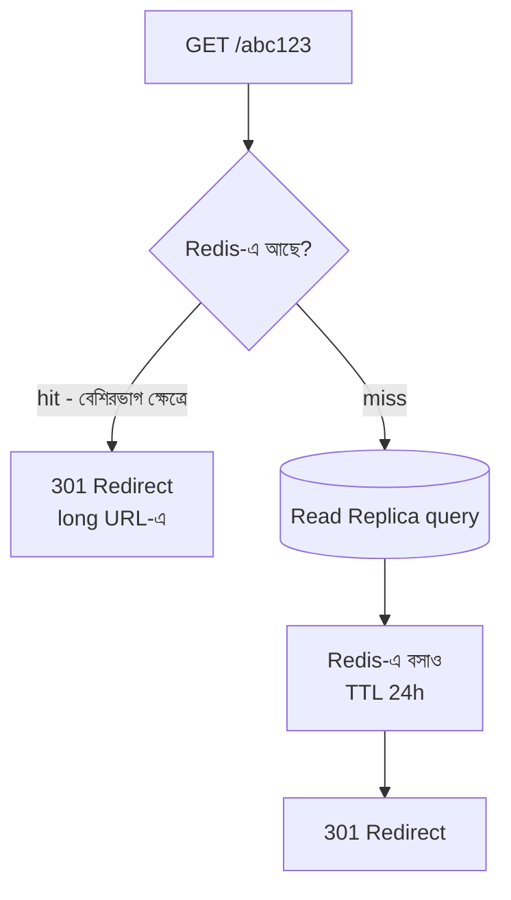

# How to Design a URL Shortener (like Bitly)
*By: Ankit Pangasa*

URL Shortener — সবচেয়ে classic system design interview question। সহজ দেখতে কিন্তু অনেক depth আছে।

---

## Requirements

**Functional**:
- Long URL → Short URL তৈরি করো (`POST /shorten`)
- Short URL-এ click করলে → Long URL-এ redirect (`GET /abc123`)

**Non-Functional**:
- **Low Latency**: redirect < 10ms
- **High Availability**: URL shortener সবসময় চালু থাকবে
- **Scalable**: Billions of URLs store করতে পারবে

---

## High-Level Design

> 📐 ডায়াগ্রাম — নিজের বোঝার জন্য যোগ করা



এই system-টা **পড়া-ভারী, লেখা-হালকা** — একটা URL একবার তৈরি হয় কিন্তু হাজার বার redirect হয়। তাই ডিজাইনের পুরো ওজন read path-এ: redirect আগে Redis-এ দেখা হয় (< 10ms), miss হলে read replica থেকে পড়ে cache-এ বসিয়ে দেয়। Write (`/shorten`) কম, তাই একটা primary DB-ই যথেষ্ট। এটাই "start simple, scale gradually"-র মূর্ত রূপ।

---

## Low-Level Design

> 📐 ডায়াগ্রাম — নিজের বোঝার জন্য যোগ করা

**Redirect-এর read path — cache hit বনাম miss:**



মূল কথা — **hot URL-গুলো প্রায় সবসময় cache hit**, তাই বেশিরভাগ redirect DB-তে পৌঁছয়ই না। প্রথমবার কেউ একটা code চাইলে miss হয়, তখন DB থেকে পড়ে ২৪ ঘণ্টার TTL সহ Redis-এ রাখা হয়; পরের হাজার request cache থেকেই সেবা পায়। এভাবে জনপ্রিয় link যত জনপ্রিয় হয়, DB-র ওপর তার চাপ তত **কমে**, বাড়ে না।

---

## Basic Design

```
Client → API Server → Database

POST /shorten
{
  "long_url": "https://very-long-url.com/path?query=value"
}
Response: { "short_url": "https://bit.ly/abc123" }

GET /abc123
Response: 301 Redirect → https://very-long-url.com/path?query=value
```

---

## Short Code Generation — তিনটি পদ্ধতি

### 1. Auto-Increment ID + Base62
```
ID: 1000000 → Base62 → "4c92" (6 chars)
```
- 62 characters: [0-9][a-z][A-Z]
- 6 chars = 62^6 = **56 billion** unique URLs
- ✅ সহজ, predictable
- ❌ Sequential — competitor পরের URL guess করতে পারে

### 2. Random String
```
random(6 chars from Base62) → "xK9p2m"
```
- ✅ Unpredictable, secure
- ❌ Collision check করতে হয়

### 3. Hash of URL
```
MD5(long_url) → first 6 chars
```
- ✅ Deterministic — same URL → same short code
- ❌ Collision possible (different URL, same hash prefix)

**Recommended**: Auto-increment ID + Base62 — সহজ ও efficient

---

## Database Schema

```sql
CREATE TABLE urls (
  id BIGINT PRIMARY KEY AUTO_INCREMENT,
  short_code VARCHAR(10) UNIQUE NOT NULL,
  long_url TEXT NOT NULL,
  user_id BIGINT,
  created_at TIMESTAMP DEFAULT NOW(),
  expires_at TIMESTAMP,
  click_count BIGINT DEFAULT 0
);
```

---

## Cache Layer (Redis)

```
GET /abc123 → Redis check
    ↓ (cache hit)
    → Long URL return → Redirect

    ↓ (cache miss)
    → Database query
    → Redis-এ cache করো (TTL: 24h)
    → Redirect
```

**কেন cache গুরুত্বপূর্ণ**?
- Popular URLs হাজার বার click হয়
- DB hit না করেই serve করা → ultra-fast

---

## Scaling Up

```
Incoming Traffic
      ↓
Load Balancers
      ↓
├── API Servers (stateless, horizontal scale)
      ↓
├── Redis Cache Cluster
      ↓ (cache miss)
└── Read Replicas (DB reads)
    Primary DB (DB writes)
```

**CDN ব্যবহার**:
- Static redirect rules CDN-এ cache করা যায়
- Edge থেকে redirect → origin server hit করতে হয় না

---

## Bottlenecks ও Solutions

| Bottleneck | Problem | Solution |
|-----------|---------|---------|
| **ID Generation** | Multiple servers একই ID নিতে পারে | UUID / Snowflake ID |
| **DB Write** | High write volume | Async write, batch insert |
| **Single DB** | Storage সীমিত | Sharding (short_code by hash) |
| **Popular URL** | Hot key in cache | Cache replication |

---

## Advanced Features

**Custom Short URL**:
```
POST /shorten
{ "long_url": "...", "custom_code": "mylink" }
```
- Check করো `mylink` taken কিনা

**Analytics**:
- Click count, referrer, location, device track করো
- Event → Kafka → Analytics service → Dashboard

**Expiration**:
- `expires_at` field রাখো
- Scheduled job expired URLs clean করো

---

## Interview Strategy

> "Start Simple, Scale Gradually" — এই principle অনুসরণ করো

**ধাপ ১**: Basic 2-tier (API + DB)
**ধাপ ২**: Cache যোগ করো
**ধাপ ৩**: Load balancer যোগ করো
**ধাপ ৪**: Read replicas, Sharding
**ধাপ ৫**: Analytics, Custom URLs, Expiration

Interviewer-কে জিজ্ঞেস করো: "কত QPS expect করছেন? Storage কত লাগবে?" — তারপর design adjust করো।
