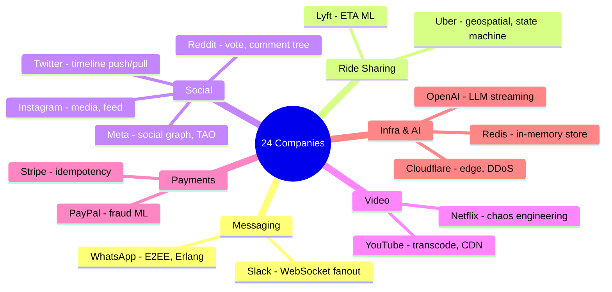

# Case Studies: 24 Major Tech Companies
*Source: Neo Kim — newsletter.systemdesign.one*

বিশ্বের সেরা tech companies কীভাবে তাদের system বানিয়েছে — প্রতিটা থেকে শিক্ষা নেওয়ার আছে।

---

## এক নজরে — কোন কোম্পানি কোন শিক্ষার জন্য

> 📐 ডায়াগ্রাম — নিজের বোঝার জন্য যোগ করা

এই তালিকার আসল ব্যবহার মুখস্থ করা নয় — **প্রতিটা কোম্পানিকে একটা করে core design lesson-এর সাথে বাঁধা**। ইন্টারভিউতে "idempotency" প্রসঙ্গ এলে Stripe, "geospatial indexing" এলে Uber, "fan-out" এলে Twitter — এভাবে একটা concept-এর সাথে একটা বাস্তব উদাহরণ জুড়ে দিলে উত্তর অনেক শক্ত হয়। ডায়াগ্রামটা সেই concept→company ম্যাপিংটাই ধরে রাখে।

---

## কোম্পানিগুলোর তালিকা

**Slack** | **Uber** | **Lyft** | **Meta** | **Bluesky** | **Figma** | **Apple** | **Reddit** | **Stripe** | **Cloudflare** | **Google** | **Tinder** | **Twitter** | **Zoom** | **WhatsApp** | **OpenAI** | **YouTube** | **Airbnb** | **PayPal** | **Redis** | **Netflix** | **Spotify** | **Instagram** | **Amazon**

---

## বিষয়ভিত্তিক শিক্ষা

### Messaging Systems
**Slack**:
- Real-time messaging for teams
- WebSocket connections, message queues
- Search indexing at scale, file sharing

**WhatsApp**:
- E2E encryption, XMPP protocol
- Erlang/Elixir for concurrency
- দেখো: 6.1.1 ও 6.1.2

### Ride-Sharing
**Uber**:
- Real-time driver matching
- Geospatial indexing (S2 geometry library)
- Surge pricing algorithm
- Trip state machine (requested → matched → en-route → completed)

**Lyft**:
- Similar to Uber but different tech choices
- Risk scoring system
- ETA prediction ML model

### Social Media
**Meta/Facebook**:
- Social graph at billions of nodes
- TAO (The Associations and Objects) — graph storage
- Like button design (দেখো: 6.2.3)
- News feed ranking

**Twitter**:
- Timeline generation (push vs pull)
- Tweet search (দেখো: 6.3.2)
- Trending topics real-time

**Instagram**:
- Photo/video at scale (দেখো: 6.2.2)
- Explore page recommendation

**Reddit**:
- Voting system (up/down)
- Comment tree storage
- Subreddit feeds

**Tinder**:
- Location-based matching
- Swipe card stack preloading
- Match recommendation algorithm

**Bluesky**:
- Decentralized social protocol (AT Protocol)
- Federated architecture — users own their data

### Video Platforms
**YouTube**:
- Video encoding pipeline (দেখো: 6.2.1)
- Recommendation engine
- Global CDN delivery

**Netflix**:
- Multi-region streaming
- Chaos Engineering (Chaos Monkey)
- A/B testing at scale
- Personalized recommendation (Cinematch → ML)

### Collaboration Tools
**Figma**:
- Real-time collaborative design
- CRDTs (Conflict-free Replicated Data Types)
- WebAssembly for performance

**Zoom**:
- Video conferencing at scale
- Adaptive bitrate for video
- End-to-end encryption

### Cloud & Infrastructure
**Cloudflare**:
- Global edge network (200+ cities)
- DDoS protection
- Workers (serverless at the edge)

**Apple**:
- iCloud sync
- Private Relay (privacy)
- App Store distribution

### Payment & Commerce
**Stripe**:
- Payment processing reliability
- Idempotency keys (সেই payment দুবার না হয়)
- Webhook delivery at scale

**PayPal**:
- Transaction processing
- Fraud detection ML
- Global currency handling

**Amazon**:
- E-commerce recommendation
- AWS infrastructure
- Warehouse management, last-mile delivery

### AI & Development
**OpenAI**:
- LLM inference at scale
- Token streaming (ChatGPT-এ real-time response)
- Rate limiting, cost management

### Music & Audio
**Spotify**:
- Music streaming, podcast
- Discover Weekly recommendation
- Lyrics sync, offline mode

### Developer Tools
**Redis**:
- In-memory data structure store
- Persistence options (RDB, AOF)
- Cluster sharding

---

## প্রতিটা Company থেকে যা শিখবে

| Company | Key Lesson |
|---------|-----------|
| Netflix | Chaos Engineering, microservices |
| Uber | Real-time geospatial, state machine |
| Stripe | Idempotency, reliability |
| Cloudflare | Edge computing, DDoS |
| Figma | CRDTs, real-time collaboration |
| OpenAI | LLM infrastructure, streaming |
| Spotify | Recommendation at scale |

---

> **Resource**: newsletter.systemdesign.one — Neo Kim-এর System Design newsletter-এ এই সব case study বিস্তারিত পাবে।
