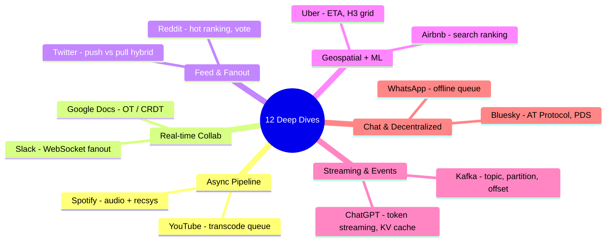

# Case Studies: 12 Companies — Technical Deep Dives
*Source: Neo Kim — newsletter.systemdesign.one*

১২টি কোম্পানির সবচেয়ে interesting technical challenges:

---

## এক নজরে — প্রতিটা কোম্পানি কোন pattern শেখায়

> 📐 ডায়াগ্রাম — নিজের বোঝার জন্য যোগ করা



আগের ডকটা (৬.৪.১) কোম্পানিকে *domain* দিয়ে সাজিয়েছিল; এটা সাজায় **যে design pattern-টা প্রতিটা কোম্পানি সবচেয়ে ভালো শেখায়** সেটা দিয়ে। এটাই এই ডকের মূল সুতো — YouTube থেকে শেখো async pipeline, Google Docs থেকে conflict resolution, Kafka থেকে event streaming-এর ভিত্তি। কয়েকটা (YouTube, WhatsApp, Twitter) আগের ডকে বিস্তারিত আছে, বাকিগুলো (Uber ETA, Google Docs OT, Kafka internals, ChatGPT inference) শুধু এখানেই — সেগুলোর দিকে বেশি মনোযোগ দাও।

---

## 1. YouTube — How YouTube Works

**Core Challenge**: Billions of hours of video, global delivery

**Key Architecture**:
- Video upload → Async transcoding (multiple resolutions)
- CDN edge caching for global delivery
- Recommendation: collaborative filtering + ML

**What to Study**: Upload pipeline, CDN strategy, recommendation
→ দেখো: [6.2.1 YouTube System Design](file:///c:/Users/Sojib%20Rd/Documents/Projects/system_design_prep/context/system_design_workbook/6.%20Case%20Studies/6.2%20Video%20%26%20Social%20Platforms/6.2.1%20YouTube%20System%20Design.md)

---

## 2. Uber — How Uber Computes ETA

**Core Challenge**: Real-time ETA (Estimated Time of Arrival) accurately

**Key Tech**:
- **Routing engine**: Dijkstra/A* on road graph
- **Historical data**: ML model trained on billions of trips
- **Real-time factors**: Current traffic, road conditions
- **Geospatial**: H3 hexagonal grid indexing

**System Design Points**:
- ETA request → Routing service → Map data (pre-computed)
- Traffic data → Kafka stream → Real-time adjustments
- ML model daily retrain on historical trip data

---

## 3. WhatsApp — How WhatsApp Works

→ দেখো: [6.1.1 How WhatsApp Works](file:///c:/Users/Sojib%20Rd/Documents/Projects/system_design_prep/context/system_design_workbook/6.%20Case%20Studies/6.1%20Chat%20%26%20Simple%20Systems/6.1.1%20How%20WhatsApp%20Works.md)

---

## 4. ChatGPT — How ChatGPT Apps Work

**Core Challenge**: LLM inference at millions of users scale

**Key Architecture**:
```
User Request → Load Balancer → API Gateway
                → Model Serving (GPU cluster)
                → Token Streaming (SSE/WebSocket)
                → Response
```

**Technical Points**:
- **Token streaming**: Response word-by-word আসে → latency কম মনে হয়
- **GPU inference**: A100/H100 GPU clusters
- **KV Cache**: Conversation history cache করে recompute এড়ানো
- **Rate limiting**: Tier-based (free vs paid users)
- **Context window**: Conversation history manage করা

---

## 5. Airbnb — How Airbnb Works

**Core Challenge**: Search, booking, payments across global marketplace

**Key Systems**:
- **Search**: Elasticsearch + ML ranking (location, price, reviews)
- **Pricing**: Dynamic pricing algorithm
- **Payments**: Split payments (host/guest), multi-currency
- **Trust**: Identity verification, review system

---

## 6. Google — How Google Docs Works

**Core Challenge**: Real-time collaborative editing (multiple users same time)

**Key Tech**:
- **OT (Operational Transformation)**: Concurrent edits merge করা
- **CRDT** (alternative): Conflict-free, no server coordination
- Architecture: WebSocket → Document Server → Change log

**Flow**:
```
User A types "hello"
User B types "world" simultaneously
OT engine → merges → "helloworld" (correct order)
```

---

## 7. Twitter — How Twitter Timeline Works

**Core Challenge**: Millions of followers, real-time feed generation

**Fan-out Approaches**:
- **Push (Fan-out on Write)**: Tweet হলে সাথে সাথে সব followers-এর timeline update — Fast read, slow write
- **Pull (Fan-out on Read)**: Read করার সময় merge — Slow read, fast write
- **Hybrid**: Regular users → Push, Celebrities → Pull

**Twitter's Solution**: Hybrid — Celebrity-র tweets read করার সময় merge

---

## 8. Kafka — How Apache Kafka Works

**Core Challenge**: High-throughput event streaming

**Architecture**:
```
Producers → Kafka Cluster → Consumers
            (Topics, Partitions)
```

**Key Concepts**:
- **Topic**: Category of events
- **Partition**: Parallel processing-এর জন্য topic ভাগ করা
- **Offset**: Consumer কতটুকু পড়েছে তার pointer
- **Consumer Group**: একটা topic একাধিক consumer group পড়তে পারে

---

## 9. Spotify — How Spotify Works

**Core Challenge**: Music streaming + personalized recommendation

**Key Systems**:
- **Audio delivery**: CDN + adaptive bitrate
- **Discover Weekly**: Collaborative filtering (কী শুনেছ) + NLP (audio features)
- **Cross-device sync**: "Continue listening on phone" — real-time sync

---

## 10. Slack — How Slack Works

**Core Challenge**: Real-time messaging for teams, search across history

**Key Architecture**:
- WebSocket connections (long-lived)
- Message fanout to all workspace members
- Full-text search across message history (Elasticsearch)
- Unread counts, notifications — eventually consistent

---

## 11. Reddit — How Reddit Works

**Core Challenge**: Voting system, comment trees, personalized feeds

**Key Systems**:
- **Voting**: Vote count eventually consistent (Cassandra)
- **Comment tree**: Nested data structure → materialized path
- **Ranking**: "Hot" algorithm (upvotes - downvotes + time decay)
- **Feed**: Subreddit posts ranked by algorithm

---

## 12. Bluesky — How Bluesky Works

**Core Challenge**: Decentralized social network (not controlled by one company)

**Key Tech**:
- **AT Protocol**: Open standard for social networking
- **Personal Data Server (PDS)**: User নিজের server চালাতে পারে
- **Relay**: All events aggregate করে
- **AppView**: Feed এবং UI serve করে

**কেন গুরুত্বপূর্ণ**: Web3/decentralized architecture-এর একটা practical example

---

## Interview-এর জন্য Priority

| Priority | Company | কেন |
|---------|---------|-----|
| ⭐⭐⭐ | YouTube | Video system — classic |
| ⭐⭐⭐ | WhatsApp | Chat system — classic |
| ⭐⭐⭐ | Twitter | Timeline, feed — classic |
| ⭐⭐⭐ | Uber | Real-time, geospatial |
| ⭐⭐ | Google Docs | Real-time collab, CRDTs |
| ⭐⭐ | Kafka | Event streaming fundamentals |
| ⭐⭐ | Spotify | Recommendation, streaming |
| ⭐ | Bluesky | Decentralized — advanced |
